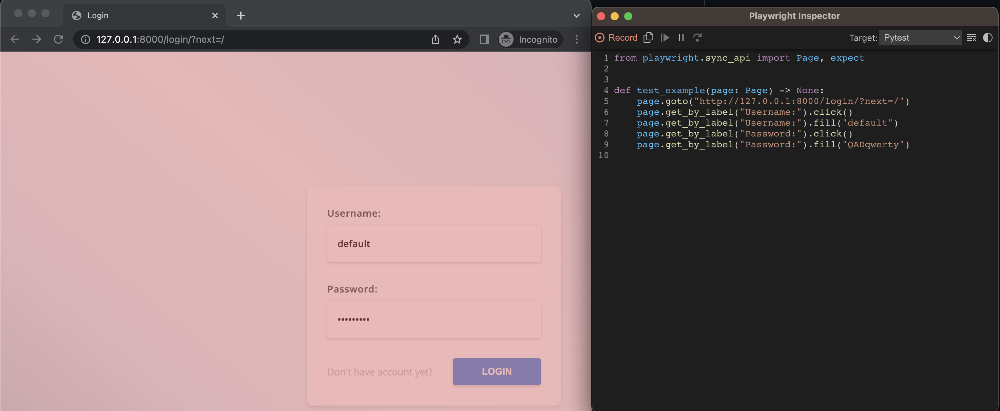
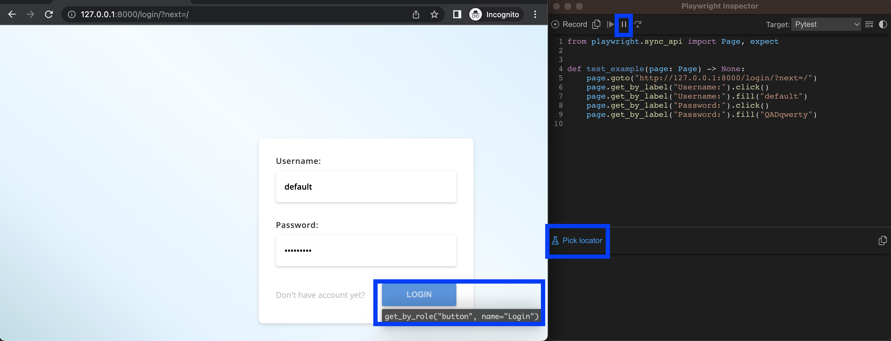
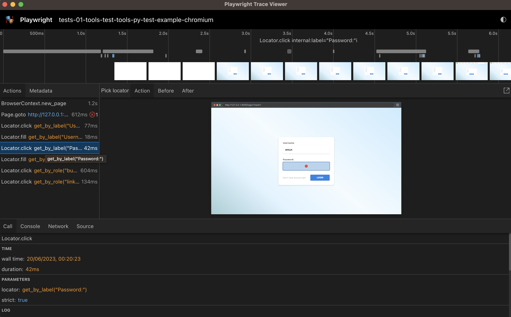
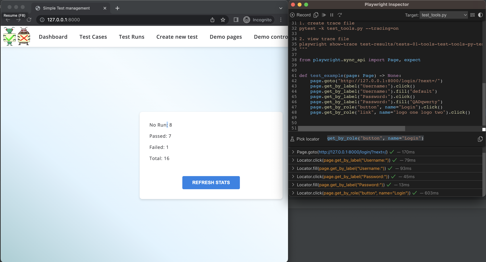
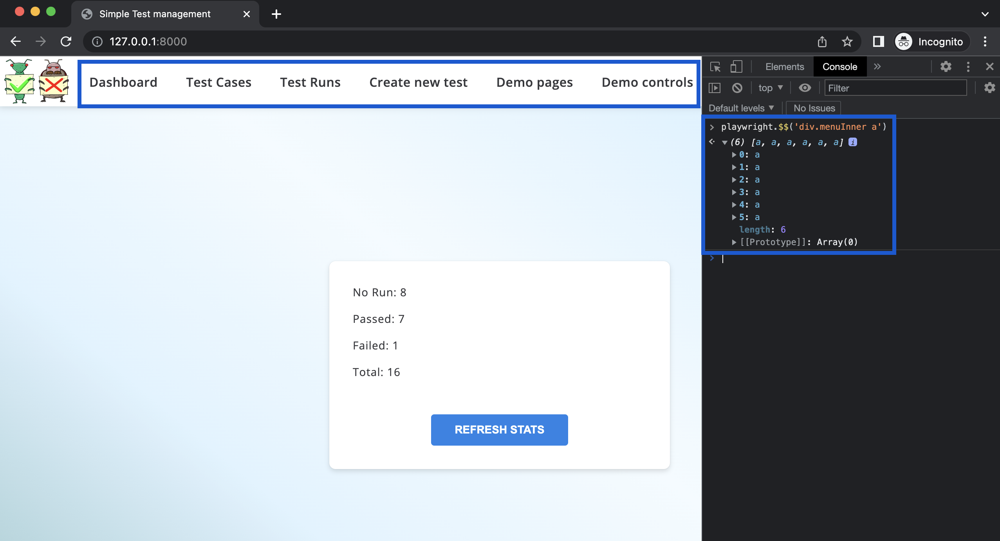
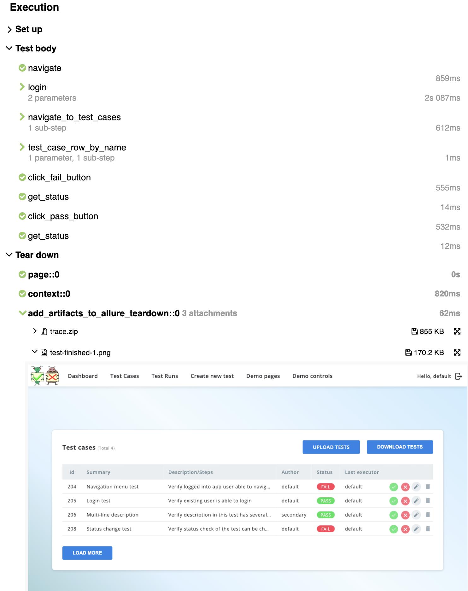
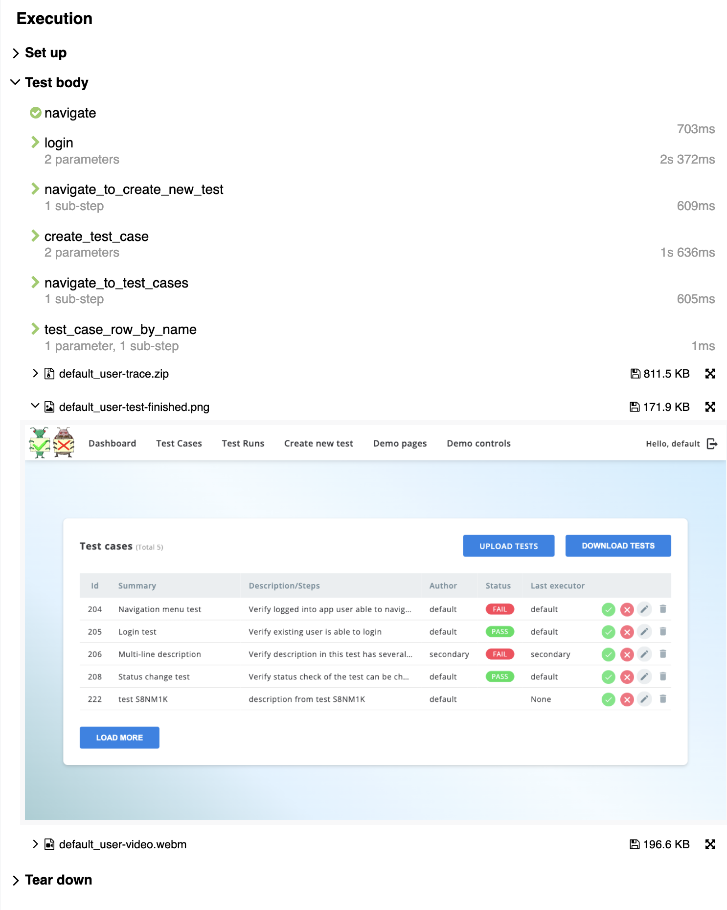

Playwright
=
### About
* Code examples to demonstrate playwright basis using pytest plugin. 
* Covered tools, locators, api, assertions, playwright features and reporting.
### Pre-setups
* Install dependencies
  * pytest 
    * `pip3 install pytest` 
  * playwright 
    * `pip3 install playwright`
    * `pip3 install pytest-playwright`
    * `playwright install`
  * 
* Prepare test environment
  * Checkout test application 
    * [`TestApp`](https://github.com/half-tested/TestApp)
  * Or use any online resources
    * [`juice-shop.herokuapp.com`](https://juice-shop.herokuapp.com/)
    * [`demoqa.com`](https://demoqa.com/)
    * [`uitestingplayground.com`](http://uitestingplayground.com/)
    * [`demo.playwright.dev/todomvc`](https://demo.playwright.dev/todomvc)
    * [`saucedemo.com`](https://www.saucedemo.com/)
    * [`the-internet.herokuapp.com`](https://the-internet.herokuapp.com/)
    * [`reqres.in`](https://reqres.in/)


Contents
-
**&nbsp;&nbsp;&nbsp;** **1. Pytest plugin:** **&nbsp;** **[`About plugin`](#about-plugin)**__,__ **[`Plugin CLI arguments`](#plugin-cli-arguments)**__,__ **[`Plugin fixtures`](#plugin-fixtures)**__,__ **[`Plugin marks`](#plugin-marks)**__.__  
**&nbsp;&nbsp;&nbsp;** **2. Tools:** **&nbsp;** **[`Codegen`](#playwright-codegen)**__,__ **[`Trace Viewer`](#trace-viewer)**__.__  
**&nbsp;&nbsp;&nbsp;** **3. Debug:** **&nbsp;**  **[`Inspector`](#inspector)**__,__**[`Browser Developer Tools`](#browser-developer-tools)**__,__ **[`Breakpoint`](#breakpoint)**__.__  
**&nbsp;&nbsp;&nbsp;** **4. Locators:** **&nbsp;**  **[`Locators recommended`](#locators-recommended)**__,__ **[`Locators css xpath text`](#locators-css-xpath-text)**__,__ **[`Locators filtering`](#locators-filtering)**__,__ **[`Chaining selectors`](#chaining-selectors)**__,__ **[`Frame locators`](#frame-locators)**__.__  
**&nbsp;&nbsp;&nbsp;** **5. POM:** **&nbsp;**  **[`Page object model`](#page-object-model)**__.__  
**&nbsp;&nbsp;&nbsp;** **6. Fixtures:** **&nbsp;**  **[`Fixtures desing`](#fixtures-design)**__,__ **[`Update fixtures`](#update-fixtures)**__.__  
**&nbsp;&nbsp;&nbsp;** **6. API:** **&nbsp;**  **[`API page.request`](#api-pagerequest)**__,__ **[`API playwright.request`](#api-playwrightrequest)**__.__  
**&nbsp;&nbsp;&nbsp;** **7. Assertions:** **&nbsp;**  **[`API responses validation`](#api-responses-validation)**__,__ **[`Page validation`](#page-validation)**__,__ **[`Locator validation`](#locator-validation)**__.__  
**&nbsp;&nbsp;&nbsp;** **8. Mock APIs:** **&nbsp;**  **[`Mock API requests`](#mock-api-requests)**__,__ **[`Modify API responses`](#modify-api-responses)**__,__ **[`Network traffic control`](#network-traffic-control)**__.__  
**&nbsp;&nbsp;&nbsp;** **9. Events:** **&nbsp;**  **[`Waiting for event`](#waiting-for-event)**__,__ **[`Adding/removing event listener`](#addingremoving-event-listener)**__,__ **[`Adding one-off listeners`](#adding-one-off-listeners)**__.__  
**&nbsp;&nbsp;&nbsp;** **10. Multiple contexts:** **&nbsp;**  **[`Multiple users`](#multiple-users)**__.__  
**&nbsp;&nbsp;&nbsp;** **11. Emulation:** **&nbsp;**  **[`Emulate device`](#emulate-device)**__,__ **[`Emulate viewport`](#emulate-viewport)**__,__ **[`Emulate locale`](#emulate-locale)**__,__ **[`Emulate geolocation`](#emulate-geolocation)**__.__  
**&nbsp;&nbsp;&nbsp;** **12. Reporting:** **&nbsp;**  **[`Allure basis`](#allure-basis)**__,__ **[`Allure fixture integration`](#allure-fixture-integration)**__,__ **[`Allure hook integration`](#allure-hook-integration)**__.__  
**&nbsp;&nbsp;&nbsp;** **13. CI/CD:** **&nbsp;**  **[`Jenkins integration`](#allure-basis)**__.__

___
[`About plugin`](#contents)
-
Playwright recommends using the official Playwright Pytest plugin to write end-to-end tests. It provides context isolation, running it on multiple browser configurations out of the box.
* Support for all modern browsers including Chromium, WebKit and Firefox.
* Support for headless and headed execution.
* Built-in fixtures that provide browser primitives to test functions.  

**Plugin sources**: [`pytest_playwright.py`](https://github.com/microsoft/playwright-pytest/blob/main/pytest_playwright/pytest_playwright.py)  
**Playwright docs**: [`plugin documentation`](https://playwright.dev/python/docs/test-runners)  
___
[`Plugin CLI arguments`](#contents)
-
* `--headed`: Run tests in headed mode (default: headless).
* `--browser`: Run tests in a different browser chromium, firefox, or webkit. It can be specified multiple times (default: `chromium`).
* `--browser-channel` Browser channel to be used.
* `--slowmo` Slows down Playwright operations by the specified amount of milliseconds. Useful so that you can see what is going on (default: `0`).
* `--device` Device to be emulated.
* `--output` Directory for artifacts produced by tests (default: `test-results`).
* `--tracing` Whether to record a trace for each test. `on`, `off`, or `retain-on-failure` (default: `off`).
* `--video` Whether to record video for each test. `on`, `off`, or `retain-on-failure` (default: `off`).
* `--screenshot` Whether to automatically capture a screenshot after each test. `on`, `off`, or `only-on-failure` (default: `off`).
___
[`Plugin fixtures`](#contents)
-
* **Function scope**: These fixtures are created when requested in a test function and destroyed when the test ends.
  * `context`: New browser context for a test.
  * `page`: New browser page for a test.
* **Session scope**: These fixtures are created when requested in a test function and destroyed when all tests end.
  * `playwright`: Playwright instance.
  * `browser_type`: BrowserType instance of the current browser.
  * `browser`: Browser instance launched by Playwright.
  * `browser_name`: Browser name as string.
  * `browser_channel`: Browser channel as string.
  * `is_chromium`, `is_webkit`, `is_firefox`: Booleans for the respective browser types.
* **Customizing fixture options**: For browser and context fixtures, use the following fixtures to define custom launch options.
  * `browser_type_launch_args`: Override launch arguments for browser_type.launch().
  * `browser_context_args`: Override the options for browser.new_context().
___
[`Plugin marks`](#contents)
-
* `@pytest.mark.skip_browser("firefox")`: Skip test by browser 
* `@pytest.mark.only_browser("chromium")`: Run on a specific browser
___
[`Playwright codegen`](#contents)
-
### Recording a test
```bash
playwright codegen http://127.0.0.1:8000 --target=python-pytest
```

`codegen` command runs test generator followed by the URL of the website to generate tests for. The URL is optional. May be provided later in browser.  
`codegen` can be launched with some specific configurations:
* `playwright codegen --viewport-size=800,600` run with specific window size
* `playwright codegen --device="iPhone 13"` emulate specific device
* `playwright codegen --timezone="Europe/Rome"` emulate timezone
* `playwright codegen --geolocation="41.890221,12.492348"` emulate geolocation
* `playwright codegen --lang="it-IT"` emulate language
* `playwright help codegen` discover all available options  

**Codegen with TestApp**: [`test_tools.py`](tests/01_tools/test_tools.py)  
**Playwright docs**: [`codegen documentation`](https://playwright.dev/python/docs/codegen-intro#running-codegen)  
### Generating locators

* Press the 'Record' button to stop the recording and the 'Pick Locator' button will appear.
* Click on the 'Pick Locator' button and then hover over elements in the browser window to see the locator highlighted underneath each element.
* To choose a locator click on the element you would like to locate and the code for that locator will appear in the field next to the Pick Locator button.

**Playwright docs**: [`generate locators`](https://playwright.dev/python/docs/codegen-intro#generating-locators)  
___
[`Trace Viewer`](#contents)
-
Playwright Trace Viewer is a GUI tool that explores recorded Playwright traces of executed tests. Provides ability to go back and forward though each action of a test and visually see what was happening during each action.
```
# create trace file
pytest -k test_tools.py --tracing=on

# view trace file
playwright show-trace test-results/tests-01-tools-test-tools-py-test-example-chromium/trace.zip
```

Provides ability to discover executed test by clicking through each action or hovering using the timeline and see the state of the page before and after the action. Inspect the log, source and network during each step of the test. The trace viewer creates a DOM snapshot so it can be fully interact with, open devtools etc.  
**Trace Viewer with TestApp**: [`test_tools.py`](tests/01_tools/test_tools.py)  
**Playwright docs**: [`about trace viewer`](https://playwright.dev/python/docs/trace-viewer-intro)
___
[`Inspector`](#contents)
-
The Playwright Inspector is a GUI tool to help with debugging Playwright tests. It allows to step through tests, live edit locators, pick locators and see actionability logs.
Set the `PWDEBUG` environment variable to run Playwright tests in debug mode. This configures Playwright for debugging and opens the inspector. 
Additional useful defaults are configured when `PWDEBUG=1` is set:
* Browsers launch in headed mode
* Default timeout is set to 0 (= no timeout)

  
**Test to run Playwright Inspector with**: [`test_debug.py`](tests/02_debug/test_debug.py)  
**Playwright docs**: [`about trace viewer`](https://playwright.dev/python/docs/debug#playwright-inspector)  
___
[`Browser Developer Tools`](#contents)
-
When running in Debug Mode with `PWDEBUG=console`, a playwright object is available in the Developer tools console. 
Developer tools can help to:
* Inspect the DOM tree and find element selectors 
* See console logs during execution (or learn how to read logs via API)
* Check network activity and other developer tools features


**Test example to run browser developer tools with**: [`test_debug.py`](tests/02_debug/test_debug.py)  
**Playwright docs**: [`about browser developer tools integration`](https://playwright.dev/python/docs/debug#browser-developer-tools)  
___
[`Breakpoint`](#contents)
-
To speed up the debugging process you can add a `page.pause()` method to your test. This way no need to step through each action of the test to get to the point where need to debug.
```python
def test_example(page: Page) -> None:
    page.goto("http://127.0.0.1:8000/login")
    page.get_by_label("Username:").fill("default")
    page.get_by_label("Password:").fill("QADqwerty")
    page.get_by_label("Password:").press("Enter")
    page.pause()
    page.get_by_role("link", name="Test Runs").click()
```
Once added a `page.pause()` call, run the test in debug mode. Clicking the `Resume` button in the Inspector will run the test and only stop on the `page.pause()`.  
**Test example for breakpoint**: [`test_debug.py`](tests/02_debug/test_debug.py)  
**Playwright docs**: [`about breakpoint`](https://playwright.dev/python/docs/debug#browser-developer-tools)
___
[`Locators recommended`](#contents)
-
* `page.get_by_role()` to locate by explicit and implicit accessibility attributes.
* `page.get_by_text()` to locate by text content.
* `page.get_by_label()` to locate a form control by associated label's text.
* `page.get_by_placeholder()` to locate an input by placeholder.
* `page.get_by_alt_text()` to locate an element, usually image, by its text alternative.
* `page.get_by_title()` to locate an element by its title attribute.
* `page.get_by_test_id()` to locate an element based on its data-testid attribute (other attributes can be configured).

```python
page.get_by_label("Username:").fill("default")
page.get_by_role("link", name="Demo controls").click()
page.get_by_placeholder("entered value appears next").type("by Placeholder value entered")
page.get_by_alt_text("logo one").click()
page.get_by_text("by Placeholder value entered").wait_for(state="hidden", timeout=3000)
```
**Code examples**: [`test_01_locators_recommended.py`](tests/03_locators/test_01_locators_recommended.py)  
**Playwright docs**: [`about recommended locators`](https://playwright.dev/python/docs/locators)  
___
[`Locators css xpath text`](#contents)
-
#### css and xpath general usage
For CSS or XPath locators, `page.locator()` should be used. Playwright auto-detects syntax so prefix css= or xpath= is not mandatory.
```python
page.locator("css=#id_username").fill("default")
page.locator("xpath=//input[@name='password']").fill("QADqwerty")
page.locator("input[type='submit']").click()  # still css without prefix "css="
page.locator("//a[text()='Demo controls']").click()  # still xpath without prefix "xpath="
```
**Code examples**: [`test_02_css_xpath_text.py`](tests/03_locators/test_02_css_xpath_text.py)  
**Playwright docs**: [`about css and xpath`](https://playwright.dev/python/docs/locators#locate-by-css-or-xpath)  
#### css advanced usage
Playwright augments standard CSS selectors in two ways:
* CSS selectors pierce open shadow DOM.
* Playwright adds custom pseudo-classes like :visible, :has-text(), :has(), :is(), :nth-match() and more.
```python
page.locator("p:has-text('username') input").fill("default")                            # :has-text()
page.locator("p:has(label[for='id_password']) input").fill("QADqwerty")                 # :has()
page.locator("input:below(#id_password)").click()                                       # :below()
page.locator(".menuBox :text('Test Cases')").click()                                    # :text()
page.locator(":nth-match(table tr:has-text('default'), 2)").wait_for(timeout=1000)      # :nth-match(selector,n)
```
**Code examples**: [`test_02_css_xpath_text.py`](tests/03_locators/test_02_css_xpath_text.py)  
**Playwright docs**: [`full css documentation`](https://playwright.dev/python/docs/other-locators#css-locator)  
#### text locator
Legacy text locator matches elements that contain passed text.
```python
page.locator("text=Username").fill("default")
page.locator("text=/Log\s*in/i").click()   # regex may be used with text locator
page.locator("text='Test Cases'").click()  # quoted text for full match and not quoted for partial match
```
**Code examples**: [`test_02_css_xpath_text.py`](tests/03_locators/test_02_css_xpath_text.py)  
**Playwright docs**: [`text locator documentation`](https://playwright.dev/python/docs/other-locators#legacy-text-locator)  
___
[`Locators filtering`](#contents)
-
#### Locators filtering by text
Locators can be filtered by text with the `locator.filter()` method. It will search for a particular string somewhere inside the element, possibly in a descendant element, case-insensitively. Can also pass a regular expression.  
```python
page.get_by_role("row").filter(has_text="Login test").get_by_role("button", name="Details").click()
```
**Code examples**: [`test_03_locators_filtering_by_text.py`](tests/03_locators/test_03_locators_filtering_by_text.py)  
**Playwright docs**: [`Locators filtering by text documentation`](https://playwright.dev/python/docs/locators#filter-by-text)  
#### Filter by child/descendant
Locators support an option to only select elements that have or have not a descendant matching another locator. Can therefore filter by any other locator such as a `locator.get_by_role()`, `locator.get_by_test_id()`, `locator.get_by_text()` etc.
```python
page.get_by_role("row").filter(has=page.locator(".FAIL")).filter(has_text="secondary").get_by_role("button", name="Details").first.click()
```
**Code examples**: [`test_04_locators_filtering_by_another_locator.py`](tests/03_locators/test_04_locators_filtering_by_another_locator.py)  
**Playwright docs**: [`Locators filtering by child/descendant`](https://playwright.dev/python/docs/locators#filter-by-childdescendant)  
___
[`Chaining selectors`](#contents)
-
By default, chained selectors resolve to an element queried by the last selector. A selector can be prefixed with `*` to capture elements that are queried by an intermediate selector.
```
playwright.$("xpath=//table >> css=tr >> css=.PASS")  # capture last element in the chain
playwright.$("xpath=//table >> *css=tr >> css=.PASS") # capture middle element in the chain due to "*"
```
**Code examples**: [`test_05_chaining_selectors.py`](tests/03_locators/test_05_chaining_selectors.py)  
**Playwright docs**: [`Chaining selectors documentation`](https://playwright.dev/python/docs/other-locators#chaining-selectors)   
___
[`Frame locators`](#contents)
-
A page can have additional frames attached with the iframe HTML tag. These frames can be accessed for interactions inside the frame.
```python
page.frame_locator("iframe[title='description']").get_by_role("textbox").type("123")
```
**Code examples**: [`test_06_frame_locators.py`](tests/03_locators/test_06_frame_locators.py)  
**Playwright docs**: [`Frame locators documentation`](https://playwright.dev/python/docs/frames)  
___
[`Page object model`](#contents)
-
Split tests and page object definition. Technique provides an ability to reuse locators, improves readability and makes code maintenance easier.
```python
login_page = LoginPage(page)
login_page.navigate()
login_page.login("default", "QADqwerty")
```
**Code examples**: [`test_pom.py`](tests/04_pom/test_pom.py)  
**Playwright docs**: [`POM documentation`](https://playwright.dev/python/docs/pom)  
___
[`Fixtures design`](#contents)
-
Fixtures provides effective way to design setup and teardown for the test. May be used to prepare test data, clear test data after test, configure environment etc. 
#### Create/delete test data
```python
@pytest.fixture()
def db(request: pytest.FixtureRequest):
    db_file_path = os.path.join(request.config.rootpath.parent, "TestApp/db.sqlite3")
    sqlite_db = Database(db_file_path)
    yield sqlite_db # yield is used for teardowns, i.e. next code going to be executed after test 
    sqlite_db.close()

@pytest.fixture()
def create_test(random_test_name, db):
    db.create_test_case(random_test_name, f"description of {random_test_name}", "default")


@pytest.fixture()
def delete_created_test(random_test_name, db):
    yield
    db.delete_test_case(random_test_name)
```
#### Design login fixture to be reused over tests
```python
@pytest.fixture()
def home_page(page: Page) -> DashboardPage:
    login_page = LoginPage(page)
    login_page.navigate()
    login_page.login("default", "QADqwerty")
    return DashboardPage(page)
```
**Code examples**: [`test_01_fixtures.py`](tests/05_fixtures/05_01_fixtures_conftest/test_01_fixtures.py)   
**Notes**: No specific recommendation from Playwright about fixtures design. Except to consider using [`Plugin fixtures`](#plugin-fixtures)  
___
[`Update fixtures`](#contents)
-
Consider to update existing fixtures. 
For example to reuse logged in state between tests `context` fixture may be updated with `storage_state` configuration:
```python
# create file with authed storage state
@pytest.fixture(scope="session", autouse=True)
def make_auth_file_state(browser: Browser, browser_context_args: Dict):
    context = browser.new_context(**browser_context_args)
    page = context.new_page()
    page.goto("/")
    page.get_by_label("Username").fill("default")
    page.get_by_label("Password").fill("QADqwerty")
    page.get_by_role("button", name="Login").click()
    context.storage_state(path=".auth")
    context.close()

# config context to use storage state
@pytest.fixture(scope="session")
def context(browser: Browser, browser_context_args: Dict):
    context = browser.new_context(**browser_context_args, storage_state=".auth")
    yield context
    context.close()
```
**Code examples**:  [`test_02_fixtures.py`](tests/05_fixtures/test_02_fixtures.py)  
___
[`API page.request`](#contents)
-
API testing helper associated with this page. This method returns the same instance as browser_context.request on the page's context.
```python
@pytest.fixture()
def login(page: Page):
    payload = {
        "username": "default",
        "password": "QADqwerty"
    }
    page.request.post("/api/auth/login", data=payload)
```
**Code examples**: 
[`test_01_api_ui_mixed.py`](tests/06_api/test_01_api_ui_mixed.py)  
**Playwright docs**: 
[`API testing`](https://playwright.dev/python/docs/api-testing)
[`page.request`](https://playwright.dev/python/docs/api/class-page#page-request)  
___
[`API playwright.request`](#contents)
-
Exposes API that can be used for the Web API testing. Not related to page context.
```python
@pytest.fixture()
def api(playwright, pytestconfig) -> APIRequestContext:
    payload = {
        "username": "default",
        "password": "QADqwerty"
    }
    api_context = playwright.request.new_context(base_url=pytestconfig.getini("base_url"))
    api_context.post("/api/auth/login", data=payload)
    yield api_context
    api_context.dispose()

@pytest.fixture()
def create_test_by_api(api, test_name, test_description):
    token = api.storage_state()["cookies"][0].get("value")
    headers = {"X-CSRFToken": f"{token}"}
    payload = {
        "name": f"{test_name}",
        "description": f"{test_description}"
    }
    response = api.post("/api/tests/new", data=payload, headers=headers)
    print(f"{response.status} {response.status_text}")
    test_id = response.json()["test_id"]
    yield test_id
    api.delete(f"/api/tests/{test_id}", headers=headers)
```
**Code examples**: 
[`test_02_api_only.py`](tests/06_api/test_02_api_only.py)  
**Playwright docs**: 
[`API testing`](https://playwright.dev/python/docs/api-testing)
[`playwright.request`](https://playwright.dev/python/docs/api/class-playwright#playwright-request)
___
[`API responses validation`](#contents)
-
Basic status code verification. Ensures the response status code is within `200..299` range. Has positive and negative implementation.
```python
# Negative case
payload = {
    "username": "default",
    "password": "wrong_password"
}
api_response = page.request.post("/api/auth/login", data=payload)
expect(api_response).not_to_be_ok()

# Positive case
payload = {
    "username": "default",
    "password": "QADqwerty"
}
api_response = page.request.post("/api/auth/login", data=payload)
expect(api_response).to_be_ok()
expect(api_response, "API response status code is not in `200..299` range").to_be_ok()
```
**Code examples**: [`test_assertions.py`](tests/07_assertions/test_assertions.py)  
**Playwright docs**: [`Assertions documenation`](https://playwright.dev/python/docs/test-assertions)  
___
[`Page validation`](#contents)
-
Provides assertion methods that can be used to make assertions about the Page state in the tests.
```python
expect(page, "Assertion message may be set up").to_have_url("http://127.0.0.1:8000/", timeout=3000)
expect(page).to_have_title("Simple Test management")
expect(page).to_have_title(re.compile(r".*Test management"))
expect(page).not_to_have_title("Not this title")
expect(page).not_to_have_url("http://127.0.0.1:8000/bad_endpoint")
```
**Code examples**: [`test_assertions.py`](tests/07_assertions/test_assertions.py)  
**Playwright docs**: [`Assertions documenation`](https://playwright.dev/python/docs/test-assertions)  
___
[`Locator validation`](#contents)
-
Provides assertion methods that can be used to make assertions about the Locator state in the tests.
```python
expect(page.locator(".logOut"), "Logout icon is not displayed").to_be_visible()
menu_items = ["Dashboard", "Test Cases", "Test Runs", "Create new test", "Demo pages", "Demo controls"]
expect(page.locator("div.menuBox").get_by_role("listitem")).to_have_count(6, timeout=1000)
expect(page.locator("div.menuBox").get_by_role("listitem")).to_have_text(menu_items)
expect(page.locator("div.account")).to_contain_text("default")
expect(page.get_by_role("button", name="Refresh Stats")).to_have_attribute("onclick", "refreshStats()")
# see full list in documentation link below
```
**Code examples**: [`test_assertions.py`](tests/07_assertions/test_assertions.py)  
**Playwright docs**: [`Assertions documenation`](https://playwright.dev/python/docs/test-assertions)  
___
[`Mock API requests`](#contents)
-
Intercept all the calls to endpoint and return the test data instead.
```python
link = "**/getstat/"
payload = json.dumps({"total": "99", "passed": "99", "failed": "99", "norun": "99"})

def handle(route: Route):
    route.fulfill(status=200, body=payload)

page.route(link, handle)
```
**Code examples**: [`test_01_mock_api.py`](tests/08_mock_api/test_01_mock_api.py)  
**Playwright docs**: [`Mock API requests`](https://playwright.dev/python/docs/mock#mock-api-requests)  
___
[`Modify API responses`](#contents)
-
Instead of mocking the request, perform the request and fulfill it with the modified response.
```python
link = "**/getstat/"

def handle(route: Route):
    response = route.fetch()
    stats = response.json()
    stats["total"] = 99
    route.fulfill(response=response, json=stats)

page.route(link, handle)
```
**Code examples**: [`test_02_modify_api.py`](tests/08_mock_api/test_02_modify_api.py)  
**Playwright docs**: [`Mock API requests`](https://playwright.dev/python/docs/mock#modify-api-responses)
___
[`Network traffic control`](#contents)
-
Any requests that a page does may be modified or aborted.
```python
# block images
page.route("**/*", lambda route: route.abort() if route.request.resource_type == "image" else route.continue_())

# modify body
def handle_route(route: Route):
    response = route.fetch()
    body = response.text()
    body = body.replace("Hello,", "Greetings,")
    route.fulfill(response=response, body=body)

page.route(f"{base_url}/**", handle_route)
# see more examples in documentation link below
```
**Code examples**: [`test_03_network_control.py`](tests/08_mock_api/test_03_network_control.py)  
**Playwright docs**: [`Network documentation`](https://playwright.dev/python/docs/network) [`Multiple routes match same pattern`](https://playwright.dev/python/docs/api/class-route#route-fallback)  
___
[`Waiting for event`](#contents)
-
Expects for event to happen during known actions. Allows to process event correctly and at the right time.
```python
with page.expect_download() as download_info:
    page.get_by_role("button", name="Download tests").click()
download = download_info.value
path = download.path()
```
**Code examples**: 
[`test_01_wait_for_event.py`](tests/09_events/test_01_wait_for_event.py)  
**Playwright docs**:
[`Waiting for event documentation`](https://playwright.dev/python/docs/events#waiting-for-event) 
[`expect_console_message`](https://playwright.dev/python/docs/api/class-page#page-wait-for-console-message) 
[`expect_download`](https://playwright.dev/python/docs/api/class-page#page-wait-for-download)
[`expect_file_chooser`](https://playwright.dev/python/docs/api/class-page#page-wait-for-file-chooser)
[`expect_popup`](https://playwright.dev/python/docs/api/class-page#page-wait-for-popup)
[`expect_request`](https://playwright.dev/python/docs/api/class-page#page-wait-for-request)
[`expect_request_finished`](https://playwright.dev/python/docs/api/class-page#page-wait-for-request-finished)
[`expect_response`](https://playwright.dev/python/docs/api/class-page#page-wait-for-response)
[`expect_websocket`](https://playwright.dev/python/docs/api/class-page#page-wait-for-web-socket)
[`expect_worker`](https://playwright.dev/python/docs/api/class-page#page-wait-for-worker)
[`expect_event`](https://playwright.dev/python/docs/api/class-page#page-wait-for-event)  
___
[`Adding/removing event listener`](#contents)
-
When events happen in random time and instead of waiting for them, they need to be handled. Playwright supports traditional language mechanisms for subscribing and unsubscribing from the events.
```python
def track_request(request):
    print(">>", request.method, request.url)

def track_response(response):
    print("<<", response.status, response.url)

page.on("request", track_request)
page.on("response", track_response)
page.get_by_role("button", name="Refresh Stats").click()
# prints:
# >> GET http://127.0.0.1:8000/getstat/
# << 200 http://127.0.0.1:8000/getstat/
page.remove_listener("request", track_request)
page.remove_listener("response", track_response)
```
**Code examples**: 
[`test_02_adding_event_listener.py`](tests/09_events/test_02_adding_event_listener.py)  
**Playwright docs**:
[`Adding/removing event listener documentation`](https://playwright.dev/python/docs/events#addingremoving-event-listener)  
___
[`Adding one-off listeners`](#contents)
-
When events happen in random time and instead of waiting for them, they need to be handled. Playwright supports traditional language mechanisms for subscribing and unsubscribing from the events.
```python
console_errors = []

def console_has_no_errors(message: ConsoleMessage):
    if message.type == "error":
        console_errors.append(message.text)

page.once("console", console_has_no_errors)
page.goto(page_name, wait_until="networkidle")
assert len(console_errors) == 0, f"'{page_name}' generated with error {console_errors}"
```
**Code examples**: 
[`test_03_adding_one_off_event_listener.py`](tests/09_events/test_03_adding_one_off_event_listener.py)  
**Playwright docs**:
[`Adding one-off listeners documentation`](https://playwright.dev/python/docs/events#adding-one-off-listeners)  
___
[`Multiple users`](#contents)
-
Playwright can create multiple browser contexts within a single scenario. This is useful to create a test with multi-user functionality.
```python
@pytest.fixture()
def secondary(browser_type, browser_type_launch_args, browser_context_args):
    secondary_browser = browser_type.launch(**browser_type_launch_args)
    secondary_context = secondary_browser.new_context(**browser_context_args)
    secondary_page = secondary_context.new_page()

    yield LoginPage(secondary_page) \
        .navigate() \
        .login("secondary", "QASqwerty")
    secondary_page.close()
    secondary_context.close()
    secondary_browser.close()
```
**Code examples**: 
[`test_multiple_roles.py`](tests/10_multiple_roles/test_multiple_roles.py)  
**Playwright docs**:
[`Multiple Contexts in a Single Test`](https://playwright.dev/python/docs/browser-contexts#multiple-contexts-in-a-single-test)  
___
[`Emulate device`](#contents)
-
Playwright comes with a registry of device parameters using playwright.devices for selected desktop, tablet and mobile devices. It can be used to simulate browser behavior for a specific device such as user agent, screen size, viewport and if it has touch enabled. All tests will run with the specified device parameters.
```python
@pytest.fixture(scope="session")
def browser_context_args(browser_context_args, playwright):
    return {**browser_context_args, **playwright.devices["iPhone 13 Pro"]}
```
**Code examples**: 
[`test_01_emulation_device.py`](tests/11_emulation/test_01_emulation_device.py)  
**Playwright docs**:
[`Emulate device`](https://playwright.dev/python/docs/emulation#devices)  
___
[`Emulate viewport`](#contents)
-
The viewport is included in the device it can be overridden for some tests with page.set_viewport_size().
```python
page.set_viewport_size({"width": 1280, "height": 1024})

# or by fixture:
@pytest.fixture(scope="session")
def browser_context_args(browser_context_args):
    return {**browser_context_args, "viewport": {"width": 1280, "height": 1024}}
```
**Code examples**: 
[`test_02_emulation_viewport.py`](tests/11_emulation/test_02_emulation_viewport.py)  
**Playwright docs**:
[`Emulate viewport`](https://playwright.dev/python/docs/emulation#viewport)  
___
[`Emulate locale`](#contents)
-
Emulate the user Locale and Timezone which can be set globally for all tests in the config and then overridden for particular tests.
```python
@pytest.fixture(scope="session")
def browser_context_args(browser_context_args):
    return {**browser_context_args, "locale": "fr_FR", "timezone_id": "Europe/Paris"}
```
**Code examples**: 
[`test_03_emulate_locale.py`](tests/11_emulation/test_03_emulate_locale.py)  
**Playwright docs**:
[`Emulate locale`](https://playwright.dev/python/docs/emulation#locale--timezone)  
___
[`Emulate geolocation`](#contents)
-
Grant "geolocation" permissions and set geolocation to a specific area.
```python
@pytest.fixture(scope="session")
def browser_context_args(browser_context_args):
    return {**browser_context_args, "geolocation": {"longitude": 2.3, "latitude": 48.9}, "permissions": ["geolocation"]}
```
**Code examples**: 
[`test_04_emulate_geolocation.py`](tests/11_emulation/test_04_emulate_geolocation.py)  
**Playwright docs**:
[`Emulate geolocation`](https://playwright.dev/python/docs/emulation#geolocation)  
___
[`Allure basis`](#contents)
-
#### step annotation
```python
@allure.step
def passing_step():
    pass

@allure.step('Step with placeholders in the title, positional: "{0}", keyword: "{key}"')
def step_with_title_placeholders(arg1, key=None):
    pass
```
#### attachments
```python
def test_multiple_attachments():
    allure.attach('simple text attachment', 'blah blah blah blah',
                  allure.attachment_type.TEXT)
    allure.attach.file('requirements.txt', attachment_type=allure.attachment_type.TEXT)
    allure.attach('<head></head><body> a page </body>', 'Attach with HTML type', allure.attachment_type.HTML)
```
#### test description
```python
@allure.description("""
Multiline test description.
That comes from the allure.description decorator.
""")
def test_description_from_decorator():
    assert 42 == int(6 * 7)


def test_unicode_in_docstring_description():
    """
    Simple test description.
    May be multiline.
    """
    assert 42 == int(6 * 7)
```
#### test title
```python
@allure.title("This test has a custom title")
def test_with_a_title():
    pass


@allure.title("Parameterized test title: adding {param1} with {param2}")
@pytest.mark.parametrize('param1,param2,expected', [
    (2, 2, 4),
    (1, 2, 5)
])
def test_with_parameterized_title(param1, param2, expected):
    assert param1 + param2 == expected
```
#### allure links
```python
@allure.link("https://your.test_with_link.com")
@allure.issue("DEF-140")
@allure.testcase("TC-230")
def test_with_links():
    pass

# patterns should bet configured if link used with placeholder
# pytest --alluredir=allure --clean-alluredir -k test_09_allure_links.py \
# --allure-link-pattern=issue:http://www.mytesttracker.com/issue/{} \
# --allure-link-pattern=tms:http://www.mytesttracker.com/tms/{}
```
#### allure tags
```python
@allure.feature('feature_2')
@allure.story('story_2')
def test_with_story_2_and_feature_2():
    pass

# following commandline options to specify different sets of tests to execute passing a list of comma-separated values:
# --allure-epics
# --allure-features
# --allure-stories
# for example:
# pytest --alluredir=allure --clean-alluredir --allure-stories story_1,story_2
```
#### allure severity
```python
@allure.severity(allure.severity_level.TRIVIAL)
def test_with_trivial_severity():
    pass

@allure.severity(allure.severity_level.NORMAL)
class TestClassWithNormalSeverity(object):

    def test_inside_the_normal_severity_test_class(self):
        pass

    @allure.severity(allure.severity_level.CRITICAL)
    def test_inside_the_normal_severity_test_class_with_overriding_critical_severity(self):
        pass

# Severity decorator can be applied to functions, methods or entire classes.
# By using --allure-severities commandline option with a list of comma-separated 
# severity levels only tests with corresponding severities will be run.
# pytest --alluredir=allure --clean-alluredir --allure-severities=critical
```
**Code examples**: 
[`test_01_allure_basic.py`](tests/12_reporting/test_01_allure_basic.py)
[`test_02_allure_xfails.py`](tests/12_reporting/test_02_allure_xfails.py)
[`test_03_allure_fixtures.py`](tests/12_reporting/test_03_allure_fixtures.py)
[`test_04_allure_parameters.py`](tests/12_reporting/test_04_allure_parameters.py)
[`test_05_allure_steps.py`](tests/12_reporting/test_05_allure_steps.py)
[`test_06_allure_attachments.py`](tests/12_reporting/test_06_allure_attachments.py)
[`test_07_allure_descriptions.py`](tests/12_reporting/test_07_allure_descriptions.py)
[`test_08_allure_titles.py`](tests/12_reporting/test_08_allure_titles.py)
[`test_09_allure_links.py`](tests/12_reporting/test_09_allure_links.py)
[`test_10_allure_tags.py`](tests/12_reporting/test_10_allure_tags.py)
[`test_11_allure_severity.py`](tests/12_reporting/test_11_allure_severity.py)  
**Allure docs**:
[`Allure for Pytest documentation`](https://docs.qameta.io/allure/#_pytest)  
___
[`Allure fixture integration`](#contents)
-
Makes after test attachments to allure report using fixture. Attachment appears in `Tear down` section in this case.
```python
@pytest.fixture(scope='function', autouse=True)
def add_artifacts_to_allure_teardown(request):
    yield

    output_dir = request.config.getoption("--output")
    output_path = os.path.join(output_dir, truncate_file_name(slugify(request.node.nodeid)))

    ext = ("png", "webm", "zip")
    if not os.path.exists(output_path):
        return
    for file in os.listdir(output_path):
        if file.endswith(ext):
            allure.attach(
                open(os.path.join(output_path, file), 'rb').read(),
                name=f"{file}",
                extension=file.split('.')[-1]
            )
```

___
[`Allure hook integration`](#contents)
-
Makes after test attachments to allure report using pytest hook. Attachment appears in `Test body` section in this case.
```python
@pytest.hookimpl(hookwrapper=True)
def pytest_runtest_makereport(item, call):
    result = yield
    report = result.get_result()
    failed = report.outcome == 'failed'
    request = item.funcargs['request']

    if call.when == "call" and "default_user_page" in item.funcargs:
        page: Page = item.funcargs["default_user_page"]
        capture_trace_if_set(page.context, failed, "default_user", item, request)
        capture_screenshot_if_set(page, failed, "default_user", item, request)
        page.context.close()  # make sure context closed for the video
        capture_video_if_set(page, failed, "default_user", item, request)
```

___
[`Jenkins integration`](#contents)
-
Jenkins pipeline is a convenient way to organize a flow of the test run. 
Stages design may depend on project needs. Minimum setup should include:
* `Git Clone` stage to checkout latest updates
* `Execute Tests` stage to run required tests scope
* `Generate Report` stage to generate and attach report to the build

Note: `allure-jenkins-plugin` may be installed to attach test report to the build.
```
node {
    stage('Git Clone') {
        git branch: 'main', credentialsId: '1b00358b-6ad1-4902-b58d-aaef42619cd9', url: 'https://github.com/half-tested/playwright-python.git'
    }
    stage('Install Requirements') {
        sh """
        pip3 install -r requirements.txt
        """
    }
    stage('Execute Tests') {
        sh """
        pytest --alluredir=allure --clean-alluredir --allure-features=custom --screenshot=on --video=off --tracing=off
        """
    }
    stage('Generate Report') {
        allure([
            includeProperties: false,
            jdk: '',
            properties: [],
            reportBuildPolicy: 'ALWAYS',
            results: [[path: 'allure']]
        ])
    }
}
```
**Jenkins docs**:
[`Pipeline documentation`](https://www.jenkins.io/doc/book/pipeline/)  
