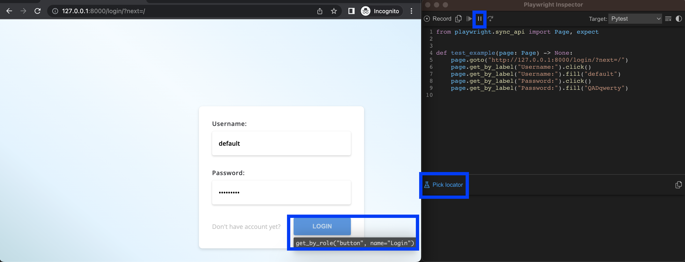

Playwright
=
### About
* Code examples to demonstrate playwright basis using pytest plugin. 
* Covered tools, locators, api, assertions, playwright features and reporting.
### Pre-setups
* Install dependencies
  * pytest 
    * `pip3 install pytest` 
  * playwright 
    * `pip3 install playwright`
    * `pip3 install pytest-playwright`
    * `playwright install`
  * 
* Prepare test environment
  * Checkout test application 
    * [`TestApp`](https://github.com/half-tested/TestApp)
  * Or use any online resources
    * [`juice-shop.herokuapp.com`](https://juice-shop.herokuapp.com/)
    * [`demoqa.com`](https://demoqa.com/)
    * [`uitestingplayground.com`](http://uitestingplayground.com/)
    * [`demo.playwright.dev/todomvc`](https://demo.playwright.dev/todomvc)
    * [`saucedemo.com`](https://www.saucedemo.com/)
    * [`lambdatest.com/selenium-playground`](https://www.lambdatest.com/selenium-playground/)
    * [`the-internet.herokuapp.com`](https://the-internet.herokuapp.com/)
    * [`testautomationpractice.blogspot.com`](https://testautomationpractice.blogspot.com/)
    * [`selectorshub.com/xpath-practice-page`](https://selectorshub.com/xpath-practice-page)
    * [`reqres.in`](https://reqres.in/)


Contents
-
**   ** **1. Pytest plugin:** ** ** **[`About plugin`](#about-plugin)**__,__ **[`Plugin CLI arguments`](#plugin-cli-arguments)**__,__ **[`Plugin fixtures`](#plugin-fixtures)**__,__ **[`Plugin marks`](#plugin-marks)**__.__  
**   ** **2. Tools:** ** ** **[`Codegen`](#playwright-codegen)**__,__ **[`Trace Viewer`](#trace-viewer)**__.__  
**   ** **3. Debug:** ** **  **[`Inspector`](#inspector)**__,__**[`Browser Developer Tools`](#browser-developer-tools)**__,__ **[`Breakpoint`](#breakpoint)**__,__ **[`Verbose API logs`](#verbose-api-logs)**__.__  
**   ** **4. Locators:** ** **  **[`Locators recommended`](#locators-recommended)**__,__ **[`Locators css xpath text`](#locators-css-xpath-text)**__,__ **[`Locators filtering`](#locators-filtering)**__,__ **[`Chaining selectors`](#chaining-selectors)**__,__ **[`Frame locators`](#frame-locators)**__.__  
**   ** **5. POM:** ** **  **[`Page object model`](#page-object-model)**__.__  
**   ** **6. Fixtures:** ** **  **[`Fixtures desing`](#fixtures-design)**__,__ **[`Update fixtures`](#update-fixtures)**__.__  
**   ** **6. API:** ** **  **[`API testing`](#api-testing)**__,__ **[`API page.request`](#api-pagerequest)**__,__ **[`API playwright.request`](#api-playwrightrequest)**__.__  
**   ** **7. Assertions:** ** **  **[`API responses validation`](#api-responses-validation)**__,__ **[`Page validation`](#page-validation)**__,__ **[`Locator validation`](#locator-validation)**__,__ **[`Assertion timeouts`](#assertion-timeouts)**__.__  
**   ** **8. Mock APIs:** ** **  **[`Mock API requests`](#mock-api-requests)**__,__ **[`Modify API responses`](#modify-api-responses)**__,__ **[`Network traffic control`](#network-traffic-control)**__,__ **[`Mocking with HAR files`](#mocking-with-har-files)**__.__  
**   ** **9. Events:** ** **  **[`Waiting for event`](#waiting-for-event)**__,__ **[`Adding/removing event listener`](#addingremoving-event-listener)**__,__ **[`Adding one-off listeners`](#adding-one-off-listeners)**__.__  
**   ** **10. Multiple contexts:** ** **  **[`Multiple users`](#multiple-users)**__.__  
**   ** **11. Emulation:** ** **  **[`Emulate device`](#emulate-device)**__,__ **[`Emulate viewport`](#emulate-viewport)**__,__ **[`Emulate locale`](#emulate-locale)**__,__ **[`Emulate geolocation`](#emulate-geolocation)**__.__  
**   ** **12. Reporting:** ** **  **[`Allure basis`](#allure-basis)**__,__ **[`Allure fixture integration`](#allure-fixture-integration)**__,__ **[`Allure hook integration`](#allure-hook-integration)**__.__  
**   ** **13. CI/CD:** ** **  **[`Jenkins integration`](#allure-basis)**__.__

___
[`About plugin`](#contents)
-
Playwright recommends using the official `pytest-playwright` plugin to write end-to-end tests. It provides context isolation, running it on multiple browser configurations out of the box.
* Support for all modern browsers including Chromium, WebKit and Firefox.
* Support for headless and headed execution.
* Built-in fixtures that provide browser primitives to test functions.  

**Plugin sources**: [`pytest_playwright.py`](https://github.com/microsoft/playwright-pytest/blob/main/pytest_playwright/pytest_playwright.py)  
**Playwright docs**: [`plugin documentation`](https://playwright.dev/python/docs/test-runners)  
___
[`Plugin CLI arguments`](#contents)
-
* `--headed` Run tests in headed mode (default: headless).
  ```
  pytest -k test_tools.py --headed  # headed mode   - browser appears
  pytest -k test_tools.py           # headless mode - browser hidden
  ```
* `--browser` Run tests in a different browser `chromium`, `firefox`, or `webkit`. It can be specified multiple times (default: `chromium`).
  ```
  pytest -k test_tools.py --browser chromium --browser firefox --browser webkit  # run 3 browsers one by one
  pytest -k test_tools.py --browser webkit                                       # run single browser
  ```
* `--browser-channel` [`Browser channel`](https://playwright.dev/python/docs/browsers#google-chrome--microsoft-edge) to be used: `chrome`, `msedge`, `chrome-beta`, `msedge-beta` or `msedge-dev`. Google Chrome and Microsoft Edge required to be installed (i.e. `playwright install chrome`)
  ```
  pytest -k test_tools.py --browser-channel chrome  # runs the test on branded browser Google Chrome
  pytest -k test_tools.py --browser-channel msedge  # runs the test on branded browser Microsoft Edge
  ```
* `--slowmo` Slows down Playwright operations by the specified amount of milliseconds. Useful so that you can see what is going on (default: `0`).
  ```
  pytest -k test_tools.py --slowmo 500  # slow down operations to 500 ms
  pytest -k test_tools.py --slowmo 0    # removes slow down even it defined in pytest.ini
  ```
* `--device` Device to be emulated. Mobile `firefox` not supported - not popular.
  ```
  pytest -k test_tools.py --device "iPhone 13 Pro"                   # emulates according device based on user agent, screen size etc.
  pytest -k test_tools.py --device "iPhone 13 Pro" --browser webkit  # same emulates device, but using webkit browser
  ```
  Note: for supported device list provide invalid argument to playwright, i.e. `playwright open --device list`
* `--tracing` Whether to record a trace for each test. `on`, `off`, or `retain-on-failure` (default: `off`).
  ```
  pytest -k test_tools.py --tracing on                 # provides the trace no matter test failed or not
  pytest -k test_tools.py --tracing retain-on-failure  # provides the trace if test failed
  pytest -k test_tools.py --tracing off                # never provide a trace
  ```
* `--video` Whether to record video for each test. `on`, `off`, or `retain-on-failure` (default: `off`).
  ```
  pytest -k test_tools.py --video on                 # provides the video no matter test failed or not
  pytest -k test_tools.py --video retain-on-failure  # provides the video if test failed
  pytest -k test_tools.py --video of                 # never provide a video
  ```
* `--screenshot` Whether to automatically capture a screenshot after each test. `on`, `off`, or `only-on-failure` (default: `off`).
  ```
  pytest -k test_tools.py --screenshot on                 # provides the screenshot no matter test failed or not
  pytest -k test_tools.py --screenshot only-on-failure    # provides the screenshot if test failed
  pytest -k test_tools.py --screenshot of                 # never provide a screenshot
  ```
* `--output` Directory for artifacts produced by tests (default: `test-results`).
  ```
  pytest -k test_tools.py --screenshot on --output custom-directory-result             # provides screenshot in non-default directory
  pytest -k test_tools.py --screenshot on --video on --output custom-directory-result  # provides screenshot and video in non-default directory
  ```
  Note: pytest plugin cleans output directory if exist

**Playwright docs**: [`plugin CLI arguments`](https://playwright.dev/python/docs/test-runners#cli-arguments)
___
[`Plugin fixtures`](#contents)
-
* **Function scope**: These fixtures are created when requested in a test function and destroyed when the test ends.
  * `context`: New browser context for a test.
  ```python
  def test_context(context):  # provides instance of context to create pages
      page_one = context.new_page()
      page_one.goto("https://www.google.com/")
      page_two = context.new_page()
      page_two.goto("https://www.bing.com/")
  ```
  * `page`: New browser page for a test.
  ```python
  def test_page(page):  # instance of page to perform all ui manipulations 
    page.goto("https://www.google.com/")
  ```
* **Session scope**: These fixtures are created when requested in a test function and destroyed when all tests end.
  * `playwright`: Playwright instance.
  ```python
  def test_playwright(playwright):
    print(playwright.devices)  # another way to list all devices, however this list includes full configuration with user agent, screen resolution etc.

    api_context = playwright.request.new_context()  # manipulate with REST API
    response = api_context.get("https://reqres.in/api/users/2")
    print(response)
    api_context.dispose()

    chromium = playwright.chromium.launch(headless=False)  # custom browser manipulations
    chromium_context = chromium.new_context()
    chromium_page = chromium_context.new_page()
    chromium_page.goto("https://www.chromium.org/Home/")
    chromium_context.close()
  ```
  * `browser_type`: BrowserType instance of the current browser.
  ```python
  def test_browser_type(browser_type):  # provides object of selected browser by argument --browser
    browser = browser_type.launch(headless=False)
    context = browser.new_context()
    page = context.new_page()
    page.goto("https://www.google.com/")
    context.close()
    browser.close()
  ```
  * `browser`: Browser instance launched by Playwright.
  ```python
  def test_browser(browser):  # provides browser instance
    context = browser.new_context()
    page = context.new_page()
    page.goto("https://www.google.com/")
    context.close()
  ```
  * `browser_name`: Browser name as string.
  ```python
  def test_browser_name(browser_name):  # provides browser name
    assert browser_name == "chromium"   # pytest -k test_browser_name --browser-channel chrome
  ```
  * `browser_channel`: Browser channel as string.
  ```python
  def test_browser_channel(browser_channel):  # provides value of argument --browser-channel
    assert browser_channel == "chrome"        # pytest -k test_browser_channel --browser-channel chrome
  ```
  * `is_chromium`, `is_webkit`, `is_firefox`: Booleans for the respective browser types.
  ```python
  def test_is_chromium(is_chromium):  # boolean indicates if chromium is used
    assert is_chromium                # pytest -k test_is_chromium --browser chromium
  ```
* **Customizing fixture options**: For browser and context fixtures, use the following fixtures to define custom launch options.
  * `browser_type_launch_args`: Override launch arguments for browser_type.launch().
  ```python
  @pytest.fixture(scope="session")
  def browser_type_launch_args(browser_type_launch_args, playwright):  # override arguments of browser_type.launch()
      return {**browser_type_launch_args,                              # such as slow_mo, headless etc.
              "headless": False,
              "slow_mo": 2_000
              }
  
  def test_browser_type_launch_args(page):  # opens a page in headed mode
      page.goto("https://www.google.com/")  # with slow down operations to 2 sec
      page.reload()
  ```
  * `browser_context_args`: Override the options for browser.new_context().
  ```python
  @pytest.fixture(scope="session")
  def browser_context_args(browser_context_args):          # override arguments of browser.new_context()
      return {**browser_context_args,                      # such as base_url, viewport,
              "base_url": "https://playwright.dev/",       # color_scheme, record_video_dir etc.
              "color_scheme": "dark",
              "viewport": {"width": 800, "height": 600}
              }

  def test_browser_context_args(page):  # opens a page according to base_url and provided color_scheme
    page.goto("/")
  ```
  
**Code examples**: 
[`02_build_in_fixtures`](tests/02_build_in_fixtures)  
**Playwright docs**: 
[`plugin fixtures`](https://playwright.dev/python/docs/test-runners#fixtures)  
___
[`Plugin marks`](#contents)
-
* `@pytest.mark.skip_browser("firefox")`: Skip test by browser 
  ```python
  @pytest.mark.skip_browser("firefox")  # Skip test for browser firefox
  def test_skip_browser(page):
    page.goto("/")

  # pytest -k test_skip_browser --browser chromium --browser firefox
  # outputs: 1 passed, 1 skipped
  ```
* `@pytest.mark.only_browser("chromium")`: Run on a specific browser
  ```python
  @pytest.mark.only_browser("chromium")  # executes only for chromium
  def test_only_browser(page):
    page.goto("/")

  # pytest -k test_only_browser --browser chromium --browser firefox --browser webkit
  # outputs: 1 passed, 2 skipped
  ```

**Code examples**: 
[`03_built_in_marks`](tests/03_built_in_marks)  
**Playwright docs**: 
[`plugin marks`](https://playwright.dev/python/docs/test-runners#skip-test-by-browser)  
___
[`Playwright codegen`](#contents)
-
### Recording a test
```bash
playwright codegen http://127.0.0.1:8000 --target=python-pytest
```

`codegen` command runs test generator followed by the URL of the website to generate tests for. The URL is optional. May be provided later in browser.  
`codegen` can be launched with some specific configurations:
* `playwright codegen --viewport-size=800,600` run with specific window size
* `playwright codegen --device="iPhone 13"` emulate specific device
* `playwright codegen --timezone="Europe/Rome"` emulate timezone
* `playwright codegen --geolocation="41.890221,12.492348"` emulate geolocation
* `playwright codegen --lang="it-IT"` emulate language
* `playwright help codegen` discover all available options  

**Codegen with TestApp**: [`test_tools.py`](tests/01_tools/test_tools.py)  
**Playwright docs**: [`codegen documentation`](https://playwright.dev/python/docs/codegen-intro#running-codegen)  
### Generating locators

* Press the 'Record' button to stop the recording and the 'Pick Locator' button will appear.
* Click on the 'Pick Locator' button and then hover over elements in the browser window to see the locator highlighted underneath each element.
* To choose a locator click on the element you would like to locate and the code for that locator will appear in the field next to the Pick Locator button.

**Playwright docs**: [`generate locators`](https://playwright.dev/python/docs/codegen-intro#generating-locators)  
___
[`Trace Viewer`](#contents)
-
Playwright Trace Viewer is a GUI tool that explores recorded Playwright traces of executed tests. Provides ability to go back and forward though each action of a test and visually see what was happening during each action.
```
# create trace file
pytest -k test_tools.py --tracing=on

# view trace file
playwright show-trace test-results/tests-01-tools-test-tools-py-test-example-chromium/trace.zip
```

Provides ability to discover executed test by clicking through each action or hovering using the timeline and see the state of the page before and after the action. Inspect the log, source and network during each step of the test. The trace viewer creates a DOM snapshot so it can be fully interact with, open devtools etc.  
**Trace Viewer with TestApp**: [`test_tools.py`](tests/01_tools/test_tools.py)  
**Playwright docs**: [`about trace viewer`](https://playwright.dev/python/docs/trace-viewer-intro)
___
[`Inspector`](#contents)
-
The Playwright Inspector is a GUI tool to help with debugging Playwright tests. It allows to step through tests, live edit locators, pick locators and see actionability logs.
Set the `PWDEBUG` environment variable to run Playwright tests in debug mode. This configures Playwright for debugging and opens the inspector. 
Additional useful defaults are configured when `PWDEBUG=1` is set:
* Browsers launch in headed mode
* Default timeout is set to 0 (= no timeout)

  
**Test to run Playwright Inspector with**: 
[`test_debug.py`](tests/04_debug/test_debug.py)  
**Playwright docs**: 
[`about Playwright inspector`](https://playwright.dev/python/docs/debug#playwright-inspector)  
___
[`Browser Developer Tools`](#contents)
-
When running in Debug Mode with `PWDEBUG=console`, a playwright object is available in the Developer tools console. 
Developer tools can help to:
* Inspect the DOM tree and find element selectors
* Check network activity and other developer tools features

Playwright object provides methods to work from console (following code examples based on login form of TestApp):
* `playwright.$(selector)`  
  Query playwright selector for an element:
  ```
  playwright.$("input[value='Login']")
  ```
* `playwright.$$(selector)`  
  Query playwright selector for elements:
  ```
  playwright.$$(".loginForm label")
  ```
* `playwright.inspect(selector)`  
  Reveal element in the `Elements` panel:
  ```
  playwright.inspect("input#id_username")
  ```
* `playwright.locator(selector)`  
  Create a locator and query matching elements:
  ```
  playwright.locator("form", "{ hasText: 'Login' }")
  ```
* `playwright.selector(element)`  
  Generates selector for the given element. For example, select an element in the `Elements` panel and pass `$0`
  ```
  playwright.selector($0)
  ```


**Test example to run browser developer tools with**: 
[`test_debug.py`](tests/04_debug/test_debug.py)  
**Playwright docs**: 
[`about browser developer tools integration`](https://playwright.dev/python/docs/debug#browser-developer-tools)
___
[`Breakpoint`](#contents)
-
To speed up the debugging process you can add a `page.pause()` method to your test. This way no need to step through each action of the test to get to the point where need to debug.
```python
def test_example(page: Page) -> None:
    page.goto("http://127.0.0.1:8000/login")
    page.get_by_label("Username:").fill("default")
    page.get_by_label("Password:").fill("QADqwerty")
    page.get_by_label("Password:").press("Enter")
    page.pause()
    page.get_by_role("link", name="Test Runs").click()
```
Once added a `page.pause()` call, run the test in debug mode. Clicking the `Resume` button in the Inspector will run the test and only stop on the `page.pause()`.  
**Test example for breakpoint**: [`test_debug.py`](tests/02_debug/test_debug.py)  
**Playwright docs**: [`about breakpoint`](https://playwright.dev/python/docs/debug#browser-developer-tools)
___
[`Verbose API logs`](#contents)
-
Playwright supports verbose logging. With this setup Playwright provides detailed logs. This includes navigation, waits for elements, element status etc. To enable verbose logging set environment variable `DEBUG=pw:api`.
```text
# logs example:
2023-07-20T09:13:48.295Z pw:api navigating to "http://127.0.0.1:8000/login", waiting until "load"
2023-07-20T09:13:48.374Z pw:api   "commit" event fired
2023-07-20T09:13:48.374Z pw:api   navigated to "http://127.0.0.1:8000/login/"
2023-07-20T09:13:48.414Z pw:api   "domcontentloaded" event fired
2023-07-20T09:13:48.521Z pw:api   "load" event fired
2023-07-20T09:13:49.032Z pw:api waiting for get_by_label("Username:")
2023-07-20T09:13:49.056Z pw:api   locator resolved to <input type="text" required="" autofocus="" name="usern…/>
2023-07-20T09:13:49.058Z pw:api elementHandle.fill("default")
2023-07-20T09:13:49.058Z pw:api   waiting for element to be visible, enabled and editable
2023-07-20T09:13:49.063Z pw:api   element is visible, enabled and editable
2023-07-20T09:13:49.295Z pw:api   "networkidle" event fired
...
```
**Playwright docs**: 
[`about verbose api logs`](https://playwright.dev/python/docs/debug#verbose-api-logs)  
___
[`Locators recommended`](#contents)
-
* `page.get_by_role()` to locate by explicit and implicit accessibility attributes.  
  Reflects how users and assistive technology perceive the page, for example whether some element is a button or a checkbox. When locating by role, you should usually pass the accessible name as well, so that the locator pinpoints the exact element.
  ```python
  page.get_by_role("link", name="demo page").click()                                # by default "name" works on contains and case non-sensitive
  page.get_by_role("link", name="Demo pages", exact=True).click()                   # to have "name" match exactly and case-sensitive
  page.get_by_role("link", name=re.compile("demo page\w+", re.IGNORECASE)).click()  # regex pattern works for "name"
  ```
  Note: by default `name` works for contains and case non-sensitive.  
  Role locators include [`buttons, checkboxes, headings, links, lists, tables, and many more`](https://www.w3.org/TR/html-aria/#docconformance) and follow W3C specifications for [`ARIA role`](https://www.w3.org/TR/wai-aria-1.2/#roles), [`ARIA attributes`](https://www.w3.org/TR/wai-aria-1.2/#aria-attributes) and [`accessible name`](https://w3c.github.io/accname/#dfn-accessible-name). Note that many html elements like `<button>` have an implicitly defined role that is recognized by the role locator.
* `page.get_by_text()` to locate by text content.
  Find an element by the text it contains. Match by a substring, exact string, or a regular expression.
  ```python
  page.get_by_text("placeholder value")                             # looks for substring, i.e. partial match and case non-sensitive
  page.get_by_text("by Placeholder value entered", exact=True)      # exact looks for exact string
  page.get_by_text(re.compile("by [Placeholder ,value]+ entered"))  # looks for regex pattern to match
  ```
* `page.get_by_label()` to locate a form control by associated label's text.
  Form controls usually have dedicated labels that could be conveniently used to interact with the form. Allows locating input elements by the text of the associated `<label>` or `aria-labelledby` element, or by the `aria-label` attribute.
  ```python
  page.get_by_label("username").fill("default")                            # find by substring                    
  page.get_by_label("Username:", exact=True).fill("default")               # find by exact string
  page.get_by_label(re.compile("user\w+", re.IGNORECASE)).fill("default")  # find by regex pattern
  ```
* `page.get_by_placeholder()` to locate an input by placeholder.
  Inputs may have a placeholder attribute to hint to the user what value should be entered.
  ```python
  page.get_by_placeholder("entered value appears next").type("by Placeholder value entered")              # search for element with placeholder by partial value
  page.get_by_placeholder("entered value appears next", exact=True).type("by Placeholder value entered")  # search for element with placeholder by exact value
  page.get_by_placeholder(re.compile("entered[\s\w]+appears next")).type("by Placeholder value entered")  # serach for element with placeholder by regex pattern
  ```
* `page.get_by_alt_text()` to locate an element, usually image, by its text alternative.
  Allows locating elements by their alt text. For example, images should have an alt attribute that describes the image.
  ```python
  page.get_by_alt_text("one").click()                       # alt text by partial match and case non-sensitive
  page.get_by_alt_text("logo one", exact=True).click()      # alt text exact match 
  page.get_by_alt_text(re.compile("[lo,go]+ one")).click()  # alt text by regex pattern
  ```
* `page.get_by_title()` to locate an element by its `title` attribute.
  ```python
  page.get_by_title("login").click()                              # identify element by partial title value
  page.get_by_title("Login", exact=True).click()                  # identify element by exact title value
  page.get_by_title(re.compile("log\wn", re.IGNORECASE)).click()  # identify element by regex pattern
  ```
* `page.get_by_test_id()` to locate an element based on its data-testid attribute (other attributes can be configured).
  Testing by `test ids` is the most resilient way of testing as even if text or role of the attribute changes the test will still pass. QA's and developers should define explicit test ids. However testing by test ids is not user facing. If the role or text value is important then consider using user facing locators such as role and text locators.
  ```python
  # <button data-testid="directions">Forward</button>
  page.get_by_test_id("directions").click()
  ```
  By default, `page.get_by_test_id()` will locate elements based on the `data-testid` attribute, but can configure by calling `selectors.set_test_id_attribute()`:  
  ```python
  playwright.selectors.set_test_id_attribute("data-pw")
  ```

**Code examples**: 
[`test_01_locators_recommended.py`](tests/05_locators/test_01_locators_recommended.py)    
**Playwright docs**: 
[`about recommended locators`](https://playwright.dev/python/docs/locators)    
___
[`Locators css xpath text`](#contents)
-
### css and xpath general usage
For CSS or XPath locators, `page.locator()` should be used. Playwright auto-detects syntax so prefix css= or xpath= is not mandatory.
```python
page.locator("css=#id_username").fill("default")
page.locator("xpath=//input[@name='password']").fill("QADqwerty")
page.locator("input[type='submit']").click()         # still css without prefix "css="
page.locator("//a[text()='Demo controls']").click()  # still xpath without prefix "xpath="
```
**Code examples**: 
[`test_02_css_xpath_text.py`](tests/05_locators/test_02_css_xpath_text.py)  
**Playwright docs**: 
[`about css and xpath`](https://playwright.dev/python/docs/locators#locate-by-css-or-xpath)  
### locator arguments
* `has`  
  Matches elements containing an element that matches an inner locator. Inner locator is queried against the outer one.
  ```python
  fail_status = page.locator(".FAIL")
  fail_rows = page.locator("tbody tr", has=fail_status)  # has child element
  ```
* `has_not`  
  Matches elements that do not contain an element that matches an inner locator. Inner locator is queried against the outer one.
  ```python
  fail_status = page.locator(".FAIL")
  not_fail_rows = page.locator("tbody tr", has_not=fail_status)  # has_not child element
  ```
* `has_text`  
  Matches elements containing specified text somewhere inside, possibly in a child or a descendant element. Matching is case-insensitive and searches for a substring.
  ```python
  rows_with_text = page.locator("tbody tr", has_text="Login test")  # has_text for child element
  ```
* `has_not_text`  
  Matches elements that do not contain specified text somewhere inside, possibly in a child or a descendant element. Matching is case-insensitive and searches for a substring.
  ```python
  rows_without_text = page.locator("tbody tr", has_not_text="Login test")  # has_not_text for child element
  ```
**Code examples**: 
[`test_03_locator_arguments.py`](tests/05_locators/test_03_locator_arguments.py)  
**Playwright docs**: 
[`locator arguments`](https://playwright.dev/python/docs/api/class-locator#locator-locator)  
### css advanced usage
Playwright augments standard CSS selectors in two ways:
* CSS selectors pierce open shadow DOM.
* Playwright adds custom pseudo-classes like `:visible`, `:has-text()`, `:has()`, `:nth-match()` and more.
```python
page.locator("p:has-text('username') input").fill("default")                            # :has-text()
page.locator("p:has(label[for='id_password']) input").fill("QADqwerty")                 # :has()
page.locator("input:below(#id_password)").click()                                       # :below()
page.locator(".menuBox :text('Test Cases')").click()                                    # :text()
page.locator(":nth-match(table tr:has-text('default'), 2)").wait_for(timeout=1000)      # :nth-match(selector,n)
```
#### CSS: matching by text
Playwright include a number of CSS pseudo-classes to match elements by their text content.
* `article:has-text("Playwright")` - the `:has-text()` matches any element containing specified text somewhere inside, possibly in a child or a descendant element. Matching is case-insensitive, trims whitespace and searches for a substring.
* `#nav-bar :text("Home")` - the `:text()` pseudo-class matches the smallest element containing specified text. Matching is case-insensitive, trims whitespace and searches for a substring.
* `#nav-bar :text-is("Home")` - the `:text-is()` pseudo-class matches the smallest element with exact text. Exact matching is case-sensitive, trims whitespace and searches for the full string.
* `#nav-bar :text-matches("reg?ex", "i")` - the `:text-matches()` pseudo-class matches the smallest element with text content matching the [`JavaScript-like regex`](https://developer.mozilla.org/en-US/docs/Web/JavaScript/Reference/Global_Objects/RegExp).
#### CSS: matching only visible elements
Playwright supports the `:visible` pseudo class in CSS selectors. For example, `css=button` matches all the buttons on the page, while `css=button:visible` only matches visible buttons. This is useful to distinguish elements that are very similar but differ in visibility.
#### CSS: matching elements based on layout
Layout pseudo-classes use bounding client rect to compute distance and relative position of the elements.
* `:right-of(div > button)` - Matches elements that are to the right of any element matching the inner selector, at any vertical position.
* `:left-of(div > button)` - Matches elements that are to the left of any element matching the inner selector, at any vertical position.
* `:above(div > button)` - Matches elements that are above any of the elements matching the inner selector, at any horizontal position.
* `:below(div > button)` - Matches elements that are below any of the elements matching the inner selector, at any horizontal position.
* `:near(div > button)` - Matches elements that are near (within 50 CSS pixels) any of the elements matching the inner selector. Pixel area can be configured `:near(div > button, 120)`, i.e. 120 pixels in this case.
#### CSS: elements that contain other elements
The `:has()` pseudo-class is an [`experimental CSS pseudo-class`](https://developer.mozilla.org/en-US/docs/Web/CSS/:has). It returns an element if any of the selectors passed as parameters relative to the `:scope` of the given element match at least one element.
```python
page.locator("article:has(div.promo)").text_content()  # returns text content of an <article> element that has a <div class=promo> inside
```
#### CSS: elements matching one of the conditions
Comma-separated list of CSS selectors will match all elements that can be selected by one of the selectors in that list.
```python
page.locator('button:has-text("Log in"), button:has-text("Sign in")').click()  # Clicks a <button> that has either a "Log in" or "Sign in" text
```
#### CSS: pick n-th match from the query result
Selects an element on given position. Note that index start from 1.
```python
page.locator(':nth-match(:text("Buy"), 3)')  # selects 3rd element that match selector
```
**Code examples**: 
[`test_02_css_xpath_text.py`](tests/05_locators/test_02_css_xpath_text.py)  
**Playwright docs**: 
[`full css documentation`](https://playwright.dev/python/docs/other-locators#css-locator)  
### text locator
Legacy text locator matches elements that contain passed text.
```python
page.locator("text=Username").fill("default")
page.locator("text=/Log\s*in/i").click()   # regex may be used with text locator
page.locator("text='Test Cases'").click()  # quoted text for full match and not quoted for partial match
```
**Code examples**: 
[`test_02_css_xpath_text.py`](tests/05_locators/test_02_css_xpath_text.py)  
**Playwright docs**: 
[`text locator documentation`](https://playwright.dev/python/docs/other-locators#legacy-text-locator)   
___
[`Locators filtering`](#contents)
-
### Locators filtering by text
Locators can be filtered by text with the `.filter()` method. It will search for a particular string somewhere inside the element, possibly in a descendant element, case-insensitively. Can also pass a regular expression.  
* `has_text`
  ```python
  page.locator("tbody tr").filter(has_text="Login test")                              # filter by text to be included
  page.locator("tbody tr").filter(has_text=re.compile("login\stest", re.IGNORECASE))  # regex applicable
  ```
* `has_not_text`
  ```python
  page.locator("tbody tr").filter(has_not_text="default")                 # filter by text to be excluded 
  page.locator("tbody tr").filter(has_not_text=re.compile("[de]+fault"))  # regex applicable
  ```
### Filter by child/descendant
Locators support an option to only select elements that have or have not a descendant matching another locator. Can therefore filter by any other locator such as a `locator.get_by_role()`, `locator.get_by_test_id()`, `locator.get_by_text()` etc.
* `has`
  ```python
  page.locator("tbody tr").filter(has=page.get_by_text("Login test"))  # filter by locator to be included
  ```
* `has_not`
  ```python
  page.locator("tbody tr").filter(has_not=page.get_by_text("default"))  # filter by locator to be excluded
  ``` 

**Code examples**: 
[`test_04_locators_filtering.py`](tests/05_locators/test_04_locators_filtering.py)  
**Playwright docs**: 
[`Locators filtering`](https://playwright.dev/python/docs/locators#filtering-locators)  
___
[`Locator operators`](#contents)
-
### Matching inside a locator
Ability to chain locators together along with filters. Initialized locator can be queried again with another locator for the child elements. Or be filtered. All mentioned can be used in chain style with any order.
```python
page.locator("tbody tr").filter(has=page.get_by_text("Login test")).locator(".editBtn").click()
```
### Matching two locators simultaneously
Method [`locator.and_()`](https://playwright.dev/python/docs/api/class-locator#locator-and) narrows down an existing locator by matching an additional locator. For example, you can combine `page.get_by_role()` and `page.get_by_title()` to match by both role and title.
```python
page.get_by_role("link").and_(page.get_by_text("Test Cases")).click()  # and_() matches several locators
```
### Matching one of the two alternative locators
[`locator.or_()`](https://playwright.dev/python/docs/api/class-locator#locator-or) to create a locator that matches any of the alternatives.
```python
page.get_by_role("button").or_(page.get_by_title("Login")).click()  # or_() matches one of locators
```
### Matching only visible elements
`locator("visible=true")` filters only visible elements.
```python
page.locator(".loadMore").locator("visible=true")  # filter visible elements
```
**Code examples**: 
[`test_05_locator_operators.py`](tests/05_locators/test_05_locator_operators.py)  
**Playwright docs**: 
[`Locator operators`](https://playwright.dev/python/docs/locators#locator-operators)  
___
[`Lists`](#contents)
-
### Count items in a list
```python
page.locator("tbody tr").count()
```
### Position elements
```python
page.locator("tbody tr").first   # first
page.locator("tbody tr").last    # last
page.locator("tbody tr").nth(5)  # 5-th
```
Note: `locator("nth=0")` also works for first element and `locator("nth=-1")` for last one.
### Iterate over elements
It's possible to get list of locator's to iterate or list of their text content by using `.all()` or `.all_text_contents()`.
```python
failed_rows = page.locator("tbody tr").filter(has=page.locator(".FAIL"))
for row in failed_rows.all():                                                               # all                                   
    print("failed row:", row.locator("td").first.text_content())                            # manipulate with each element

not_failed_rows = page.locator("tbody tr").filter(has_not=page.locator(".FAIL"))            
print("not failed rows:", not_failed_rows.locator("td:first-of-type").all_text_contents())  # all_text_contents provides the list of each element text content
```
**Code examples**: 
[`test_06_locators_list.py`](tests/05_locators/test_06_locators_list.py)  
**Playwright docs**: 
[`Lists`](https://playwright.dev/python/docs/locators#lists)  
___
[`Chaining selectors`](#contents)
-
By default, chained selectors resolve to an element queried by the last selector. A selector can be prefixed with `*` to capture elements that are queried by an intermediate selector.
```
playwright.$("xpath=//table >> css=tr >> css=.PASS")  # capture last element in the chain
playwright.$("xpath=//table >> *css=tr >> css=.PASS") # capture middle element in the chain due to "*"
```
**Code examples**: 
[`test_05_chaining_selectors.py`](tests/05_locators/test_07_chaining_selectors.py)  
**Playwright docs**: 
[`Chaining selectors documentation`](https://playwright.dev/python/docs/other-locators#chaining-selectors)   
___
[`Frame locators`](#contents)
-
A page can have additional frames attached with the iframe HTML tag. These frames can be accessed for interactions inside the frame.
```python
page.frame_locator("iframe[title='description']").get_by_role("textbox").type("123")
```
**Code examples**: 
[`test_06_frame_locators.py`](tests/05_locators/test_08_frame_locators.py)  
**Playwright docs**: 
[`Frame locators documentation`](https://playwright.dev/python/docs/frames)  
___
[`Waits`](#contents)
-
By default, Playwright waits for locator or page action to be performed for `30 sec`. This covers all actions with `timeout` argument like `locator("table).click()` or `page.goto("/")`.  

Options to change default timeout:
- directly in action, i.e. `locator("table).click(timeout=2_000)` or `page.goto("/", timeout=3_000)`.
- set [`browser_context.set_default_timeout()`](https://playwright.dev/python/docs/api/class-browsercontext#browser-context-set-default-timeout) or [`page.set_default_timeout()`](https://playwright.dev/python/docs/api/class-page#page-set-default-timeout)
- set [`browser_context.set_default_navigation_timeout()`](https://playwright.dev/python/docs/api/class-browsercontext#browser-context-set-default-navigation-timeout) or [`page.set_default_navigation_timeout()`](https://playwright.dev/python/docs/api/class-page#page-set-default-navigation-timeout)
  These settings takes priority over `set_default_timeout` and will change the default maximum navigation time for the following methods:
    - `page.go_back()`
    - `page.go_forward()`
    - `page.goto()`
    - `page.reload()`
    - `page.set_content()`
    - `page.expect_navigation()`
    - `page.wait_for_url()`  
  
Note that timeout set on context level affects all related to context pages. However, if timeout is set on page level then it takes priority over context.

**Playwright docs**: 
[`Auto-waiting`](https://playwright.dev/python/docs/actionability) 
[`Navigations`](https://playwright.dev/python/docs/navigations)
___
[`Page object model`](#contents)
-
Split tests and page object definition. Technique provides an ability to reuse locators, improves readability and makes code maintenance easier.
### POM implementation
#### Page class init with playwright page fixture
```python
class LoginPage:
    def __init__(self, page: Page):
        self.page = page
        self.username_input = page.get_by_label("Username")
        self.password_input = page.get_by_label("Password")
        self.login_button = page.get_by_role("button", name="Login")

    def login(self, username: str, password: str) -> DashboardPage:
        self.username_input.fill(username)
        self.password_input.fill(password)
        self.login_button.click()
        return DashboardPage(self.page)

    def navigate(self):
        self.page.goto("/login")
        return self
```
#### BasePage
Manage most of the common UI elements from separate file. For example, logo and main navigation can be placed here.
```python
class BasePage:
    def __init__(self, page: Page):
        self.page = page
        self.logo_icon = page.get_by_role("link", name="logo")
        self.welcome_text = page.get_by_role("heading", name="Hello")
        self.logout_icon = page.locator(".logOut")

    def navigate_to(self, menu_item: str):
        self.page.get_by_role("link", name=f"{menu_item}").click()

    def navigate_to_create_new_test(self):
        self.navigate_to("Create new test")
        from pages.NewTestCasePage import NewTestCasePage
        return NewTestCasePage(self.page)
```
#### Page child of BasePage
```python
class TestCasesPage(BasePage):
    __test__ = False

    def __init__(self, page: Page):
        super().__init__(page)
        self.rows = page.get_by_role("row")

    def rows_by_name(self, test_name: str):
        return self.rows.filter(has_text=f"{test_name}")
```
#### Complex elements should have own class
```python
class TestCaseRow:
    __test__ = False

    def __init__(self, locator: Locator):
        self.locator = locator
        self.pass_button = self.locator.get_by_role("button", name="PASS")
        self.fail_button = self.locator.get_by_role("button", name="FAIL")
        self.edit_button = self.locator.get_by_role("button", name="Details")
        self.delete_button = self.locator.get_by_role("button", name="Delete")
        self.description = self.locator.locator(".ttDes")
        self.author = self.locator.locator(".ttAuthor")
        self.status = self.locator.locator(".ttStatus")

    def click_pass_button(self):
        self.pass_button.click()

    def click_fail_button(self):
        self.fail_button.click()

    def click_delete_button(self):
        self.delete_button.click()
        return self

    def get_status(self):
        return self.status.text_content()
```
### POM usage
#### Using POM straightforward way
```python
login_page = LoginPage(page)
login_page.navigate()
login_page.login("default", "QADqwerty")
```
#### Using POM from fixture
```python
# conftest.py content:
@pytest.fixture()
def login_screen(page: Page):
    return LoginPage(page)


@pytest.fixture()
def dashboard_screen(page: Page):
    return DashboardPage(page)


@pytest.fixture()
def testcases_screen(page: Page):
    return TestCasesPage(page)

# test_file.py content:
def test_with_defined_page_fixtures(login_screen, dashboard_screen, testcases_screen):
    existing_test = "Login test"

    login_screen.navigate()
    login_screen.login("default", "QADqwerty")
    dashboard_screen.navigate_to_test_cases()
    assert testcases_screen.test_case_row_by_name(existing_test).is_displayed(), \
        f"'{existing_test}' is not in the test cases list"
```
#### Using POM in chain style
```python
test_case = LoginPage(page) \
    .navigate() \
    .login("default", "QADqwerty") \
    .navigate_to_create_new_test() \
    .create_test_case(test_name, test_description) \
    .navigate_to_test_cases() \
    .test_case_row_by_name(test_name)
```
#### Using POM from metaclass
```python
# App.py content:
class App:
    def __init__(self, page: Page):
        self.page = page
        self.login = LoginPage(self.page)
        self.dashboard = DashboardPage(self.page)
        self.test_cases = TestCasesPage(self.page)
        self.new_test_case = NewTestCasePage(self.page)
        self.navigate = BasePage(self.page)

# test_file.py content:
app = App(page)
    app.login.navigate()
    app.login.login("default", "QADqwerty")
    app.navigate.navigate_to_test_cases()
    assert app.test_cases.test_case_row_by_name(existing_test).is_displayed(), \
        f"'{existing_test}' is not in the test cases list"
```
**Code examples**: 
[`test_pom.py`](tests/06_pom/test_pom.py) [`pages`](pages)  
**Playwright docs**: 
[`POM documentation`](https://playwright.dev/python/docs/pom)  
___
[`Fixtures design`](#contents)
-
Fixtures provides effective way to design setup and teardown for the test. May be used to prepare test data, clear test data after test, configure environment etc. 
#### Create/delete test data
```python
@pytest.fixture()
def db(request: pytest.FixtureRequest):
    db_file_path = os.path.join(request.config.rootpath.parent, "TestApp/db.sqlite3")
    sqlite_db = Database(db_file_path)
    yield sqlite_db # yield is used for teardowns, i.e. next code going to be executed after test 
    sqlite_db.close()

@pytest.fixture()
def create_test(random_test_name, db):
    db.create_test_case(random_test_name, f"description of {random_test_name}", "default")


@pytest.fixture()
def delete_created_test(random_test_name, db):
    yield
    db.delete_test_case(random_test_name)
```
#### Design login fixture to be reused over tests
```python
@pytest.fixture()
def home_page(page: Page) -> DashboardPage:
    login_page = LoginPage(page)
    login_page.navigate()
    login_page.login("default", "QADqwerty")
    return DashboardPage(page)
```
**Code examples**: 
[`test_01_fixtures.py`](tests/07_fixtures/07_01_fixtures_conftest/test_01_fixtures.py)  
**Notes**: 
No specific recommendation from Playwright about fixtures design. Except to consider using [`Plugin fixtures`](#plugin-fixtures)  
___
[`Update fixtures`](#contents)
-
Consider to update existing fixtures. 
For example to reuse logged in state between tests `context` fixture may be updated with `storage_state` configuration:
```python
# create file with authed storage state
@pytest.fixture(scope="session", autouse=True)
def make_auth_file_state(browser: Browser, browser_context_args: Dict):
    context = browser.new_context(**browser_context_args)
    page = context.new_page()
    page.goto("/")
    page.get_by_label("Username").fill("default")
    page.get_by_label("Password").fill("QADqwerty")
    page.get_by_role("button", name="Login").click()
    context.storage_state(path=".auth")
    context.close()

# config context to use storage state
@pytest.fixture(scope="session")
def context(browser: Browser, browser_context_args: Dict):
    context = browser.new_context(**browser_context_args, storage_state=".auth")
    yield context
    context.close()
```
**Code examples**: 
[`test_02_fixtures.py`](tests/07_fixtures/test_02_fixtures_reuse_login.py)  
___
[`API testing`](#contents)
-
### APIRequestContext
Each Playwright browser context has associated with it APIRequestContext instance which shares cookie storage with the browser context and can be accessed via [`context.request`]((#api-pagerequest)) or [`page.request`](#api-pagerequest). It is also possible to create a new APIRequestContext instance manually by calling [`playwright.request.new_context()`](#api-playwrightrequest).
#### Cookie management
* based on browser context  
  APIRequestContext returned by [`context.request`](#api-pagerequest) and [`page.request`](#api-pagerequest) shares cookie storage with the corresponding BrowserContext. Each API request will have Cookie header populated with the values from the browser context. If the API response contains Set-Cookie header it will automatically update BrowserContext cookies and requests made from the page will pick them up. This means that if log in using this API, then e2e test will be logged in and vice versa.
* isolated from browser context  
  If you need API requests to not interfere with the browser cookies then should create a new APIRequestContext by calling [`playwright.request.new_context()`](#api-playwrightrequest). Such APIRequestContext object will have its own isolated cookie storage.  
#### HTTP methods
* [`get`](https://playwright.dev/python/docs/api/class-apirequestcontext#api-request-context-get)
  ```python
  headers = {
    "Accept": "application/json"
  }
  query_params = {
    "isbn": "1234",
    "page": "23"
  }
  api_request_context.get("https://example.com/api/getText", headers=headers, params=query_params)
  ```
* [`post`](https://playwright.dev/python/docs/api/class-apirequestcontext#api-request-context-post)  
  JSON objects can be passed directly to the request:
  ```python
  data = {
    "title": "Book Title",
    "body": "John Doe",
  }
  api_request_context.post("https://example.com/api/createBook", data=data)
  ```
  To send form data to the server use form option. Its value will be encoded into the request body with application/x-www-form-urlencoded encoding:
  ```python
  formData = {
    "title": "Book Title",
    "body": "John Doe",
  }
  api_request_context.post("https://example.com/api/findBook", form=formData)
  ```
  The common way to send file(s) in the body of a request is to upload them as form fields with multipart/form-data encoding:
  ```python
  api_request_context.post(
  "https://example.com/api/uploadScrip'",
  multipart={
    "fileField": {
      "name": "f.js",
      "mimeType": "text/javascript",
      "buffer": b"console.log(2022);",
    },
  })
  ```
* [`put`](https://playwright.dev/python/docs/api/class-apirequestcontext#api-request-context-put)
* [`patch`](https://playwright.dev/python/docs/api/class-apirequestcontext#api-request-context-patch)
* [`delete`](https://playwright.dev/python/docs/api/class-apirequestcontext#api-request-context-delete)  

Each method will populate request cookies from the context and update context cookies from the response. The method will automatically follow redirects.
#### storage_state
Returns storage state for this request context, contains current cookies and local storage snapshot.
```python
storage = api_context.storage_state("file_path")
```
#### dispose
All responses returned by api_context.get() and similar methods are stored in the memory, so that can be later called with api_response.body(). This method discards all stored responses, and makes api_response.body() throw "Response disposed" error.
````python
api_context.dispose()
````
### APIResponse
Represents returned response object. Provides info about status code, headers, response body etc.
```python
response = context.get("https://example.com/user/repos")
assert response.ok
assert response.status == 200
assert response.headers["content-type"] == "application/json; charset=utf-8"
assert response.json()["name"] == "foobar"
assert response.body() == '{"status": "ok"}'
```
___
[`API page.request`](#contents)
-
API testing helper associated with this page. This method returns the same instance as browser_context.request on the page's context.
```python
@pytest.fixture()
def login(page: Page):
    payload = {
        "username": "default",
        "password": "QADqwerty"
    }
    page.request.post("/api/auth/login", data=payload)
```
**Code examples**: 
[`test_01_api_ui_mixed.py`](tests/08_api/test_01_api_ui_mixed.py)  
**Playwright docs**: 
[`API testing`](https://playwright.dev/python/docs/api-testing)
[`page.request`](https://playwright.dev/python/docs/api/class-page#page-request)  
___
[`API playwright.request`](#contents)
-
Exposes API that can be used for the Web API testing. Not related to page context.
```python
@pytest.fixture()
def api(playwright, pytestconfig) -> APIRequestContext:
    payload = {
        "username": "default",
        "password": "QADqwerty"
    }
    api_context = playwright.request.new_context(base_url=pytestconfig.getini("base_url"))
    api_context.post("/api/auth/login", data=payload)
    yield api_context
    api_context.dispose()

@pytest.fixture()
def create_test_by_api(api, test_name, test_description):
    token = api.storage_state()["cookies"][0].get("value")
    headers = {"X-CSRFToken": f"{token}"}
    payload = {
        "name": f"{test_name}",
        "description": f"{test_description}"
    }
    response = api.post("/api/tests/new", data=payload, headers=headers)
    print(f"{response.status} {response.status_text}")
    test_id = response.json()["test_id"]
    yield test_id
    api.delete(f"/api/tests/{test_id}", headers=headers)
```
**Code examples**: 
[`test_02_api_only.py`](tests/08_api/test_02_api_only.py)  
**Playwright docs**: 
[`API testing`](https://playwright.dev/python/docs/api-testing)
[`playwright.request`](https://playwright.dev/python/docs/api/class-playwright#playwright-request)
___
[`API responses validation`](#contents)
-
Basic status code verification. Ensures the response status code is within `200..299` range. Has positive and negative implementation.
```python
# Negative case
payload = {
    "username": "default",
    "password": "wrong_password"
}
api_response = page.request.post("/api/auth/login", data=payload)
expect(api_response).not_to_be_ok()

# Positive case
payload = {
    "username": "default",
    "password": "QADqwerty"
}
api_response = page.request.post("/api/auth/login", data=payload)
expect(api_response).to_be_ok()
expect(api_response, "API response status code is not in `200..299` range").to_be_ok()
```
**Code examples**: 
[`test_assertions.py`](tests/09_assertions/test_assertions.py)  
**Playwright docs**: 
[`Assertions documenation`](https://playwright.dev/python/docs/test-assertions)  
___
[`Page validation`](#contents)
-
Provides assertion methods that can be used to make assertions about the Page state in the tests.
```python
expect(page, "Assertion message may be set up").to_have_url("http://127.0.0.1:8000/", timeout=3000)
expect(page).to_have_title("Simple Test management")
expect(page).to_have_title(re.compile(r".*Test management"))
expect(page).not_to_have_title("Not this title")
expect(page).not_to_have_url("http://127.0.0.1:8000/bad_endpoint")
```
**Code examples**: 
[`test_assertions.py`](tests/09_assertions/test_assertions.py)  
**Playwright docs**: 
[`Assertions documenation`](https://playwright.dev/python/docs/test-assertions)  
___
[`Locator validation`](#contents)
-
Provides assertion methods that can be used to make assertions about the Locator state in the tests.
```python
expect(page.locator(".logOut"), "Logout icon is not displayed").to_be_visible()
menu_items = ["Dashboard", "Test Cases", "Test Runs", "Create new test", "Demo pages", "Demo controls"]
expect(page.locator("div.menuBox").get_by_role("listitem")).to_have_count(6, timeout=1000)
expect(page.locator("div.menuBox").get_by_role("listitem")).to_have_text(menu_items)
expect(page.locator("div.account")).to_contain_text("default")
expect(page.get_by_role("button", name="Refresh Stats")).to_have_attribute("onclick", "refreshStats()")
expect(page.get_by_role("button", name="Login")).to_have_css("color", "rgb(37, 130, 231)")
# see full list in documentation link below
```
**Code examples**: 
[`test_assertions.py`](tests/09_assertions/test_assertions.py)  
**Playwright docs**: 
[`Assertions documenation`](https://playwright.dev/python/docs/test-assertions)  
___
[`Assertion timeouts`](#contents)
-
It's possible to specify a custom timeout for assertions either globally or per assertion. The default timeout is 5 seconds.
### Global assertion timeout
Affects all assertions done with `expect`
```python
expect.set_options(timeout=10_000)  # set 10 sec timeout for all assertions
```
### Per assertion timeout
Affect single `expect` assertion configured with `timeout` argument
```python
expect(page.get_by_role("button", name="login")).to_be_visible(timeout=10_000)  # set 10 sec timeout only for current assertion
```

**Playwright docs**: 
[`Assertion timeouts`](https://playwright.dev/python/docs/test-assertions#setting-a-custom-timeout)  
___
[`Mock API requests`](#contents)
-
Intercept all the calls to endpoint and return the test data instead.

Defined payload data be used with `route.fulfill()` to mock request to the server. To register interception `page.route` should be used.
```python
link = "**/getstat/"
payload = json.dumps({"total": "99", "passed": "99", "failed": "99", "norun": "99"})

def handle(route: Route):
    route.fulfill(status=200, body=payload)

page.route(link, handle)
```
**Code examples**: 
[`test_01_mock_api.py`](tests/10_mock_api/test_01_mock_api.py)  
**Playwright docs**: 
[`Mock API requests`](https://playwright.dev/python/docs/mock#mock-api-requests)  
___
[`Modify API responses`](#contents)
-
Instead of mocking the request, perform the request and fulfill it with the modified response.

Response can be fetched with `route.fetch()`. Actual request to the server is done in this case. Next response can be modified as needed and returned for the page with `route.fulfill`.
```python
link = "**/getstat/"

def handle(route: Route):
    response = route.fetch()
    stats = response.json()
    stats["total"] = 99
    route.fulfill(response=response, json=stats)

page.route(link, handle)
```
**Code examples**: 
[`test_02_modify_api.py`](tests/10_mock_api/test_02_modify_api.py)  
**Playwright docs**: 
[`Mock API requests`](https://playwright.dev/python/docs/mock#modify-api-responses)
___
[`Network traffic control`](#contents)
-
Any requests that a page does may be modified or aborted.  

It's possible to have several interceptions when URL pattern match. Can be the case when any page should be processed for different purposes. For example, page source change and image disable or process GET and POST requests differently. In this case it's important to use `route.fallback()` for the request to be available on next interception.   
```python
# block images
page.route("**/*", lambda route: route.abort() if route.request.resource_type == "image" else route.fallback())

# modify body
def handle_route(route: Route):
    if route.request.resource_type != "document":
        route.fallback()
    else:
        response = route.fetch()
        body = response.text()
        body = body.replace("Hello,", "Greetings,")
        route.fulfill(response=response, body=body)
page.route("**/*", handle_route)
```
**Note**: When several routes match the given pattern, they run in the order opposite to their registration. That way the last registered route can always override all the previous ones.
```python
page.route("**/*", lambda route: route.abort())     # Runs last
page.route("**/*", lambda route: route.fallback())  # Runs second
page.route("**/*", lambda route: route.fallback())  # Runs first
```
**Code examples**: 
[`test_03_network_control.py`](tests/10_mock_api/test_03_network_control.py)  
**Playwright docs**: 
[`Network documentation`](https://playwright.dev/python/docs/network) [`Multiple routes match same pattern`](https://playwright.dev/python/docs/api/class-route#route-fallback)  
___
[`Mocking with HAR files`](#contents)
-
A HAR file is an [`HTTP Archive`](http://www.softwareishard.com/blog/har-12-spec/) file that contains a record of all the network requests that are made when a page is loaded. It contains information about the request and response headers, cookies, content, timings, and more. HAR files can be used to mock network requests in your tests.
### Recording a HAR file
To record a HAR file we use [`page.route_from_har()`](https://playwright.dev/python/docs/api/class-page#page-route-from-har) or [`browser_context.route_from_har()`](https://playwright.dev/python/docs/api/class-browsercontext#browser-context-route-from-har) method. This method takes in the path to the HAR file and an optional object of options. The options object can contain the URL so that only requests with the URL matching the specified glob pattern will be served from the HAR File. If not specified, all requests will be served from the HAR file.

Setting update option to true will create or update the HAR file with the actual network information instead of serving the requests from the HAR file. Use it when creating a test to populate the HAR with real data.
```python
page.route_from_har("./hars/home_page.har", url="**/getstat/", update=True)
```
### Modifying a HAR file
Once HAR file is recorded, can modify it by opening the hashed .txt file inside 'hars' folder and editing the JSON. 
```json
{"total": 400, "passed": 3, "failed": 1, "norun": 0}
```
### Replaying from HAR file
Modified HAR file can be used to serve matching responses in the test. For this, `update=False` option should be used. This will run the test against the HAR file instead of hitting the API.
```python
page.route_from_har("./hars/home_page.har", url="**/getstat/", update=False)
```
**Code examples**: 
[`test_04_mock_with_har_files.py`](tests/10_mock_api/test_04_mock_with_har_files.py)  
**Playwright docs**: 
[`Mocking with HAR files`](https://playwright.dev/python/docs/mock#mocking-with-har-files)  
___
[`Waiting for event`](#contents)
-
Expects for event to happen during known actions. Allows to process event correctly and at the right time.
```python
# download a file
with page.expect_download() as download_info:
    page.get_by_role("button", name="Download tests").click()
download = download_info.value
path = download.path()

# expect request on the page
page.set_default_timeout(5_000)  # change the default maximum time for all the methods accepting `timeout` option
with page.expect_request("**/getstat/") as request:
    page.goto("/")
assert request.value.method == "GET"
assert request.value.url == "http://127.0.0.1:8000/getstat/"

# handle new page 
context.set_default_timeout(5_000)  # change the default maximum time for all the methods accepting `timeout` option
page.goto("/demoPages")
# get page after a specific action (e.g. clicking a button, link etc.)
with context.expect_page() as new_page_info:
    page.get_by_role("button", name="new page").click(modifiers=["Shift"])
new_page = new_page_info.value
assert len(context.pages) == 2

# handle attached frame by using expect_event()
with page.expect_event("frameattached") as event_info:
    page.goto("/demoControls")
frame: Frame = event_info.value
frame.get_by_role("textbox").type("text")
```
### Page methods of events
* [`expect_console_message`](https://playwright.dev/python/docs/api/class-page#page-wait-for-console-message)  
  Performs action and waits for a [`ConsoleMessage`](https://playwright.dev/python/docs/api/class-consolemessage) to be logged by in the page.  
  Will throw an error if the page is closed before the `page.on("console")` event is fired.  
  Returns [`EventContextManager`](https://docs.python.org/3/reference/datamodel.html#context-managers)\[[`ConsoleMessage`](https://playwright.dev/python/docs/api/class-consolemessage)\]  
* [`expect_download`](https://playwright.dev/python/docs/api/class-page#page-wait-for-download)
  Performs action and waits for a new [`Download`](https://playwright.dev/python/docs/api/class-download).  
  Will throw an error if the page is closed before the download event is fired.  
  Returns [`EventContextManager`](https://docs.python.org/3/reference/datamodel.html#context-managers)\[[`Download`](https://playwright.dev/python/docs/api/class-download)\]  
* [`expect_file_chooser`](https://playwright.dev/python/docs/api/class-page#page-wait-for-file-chooser)  
  Performs action and waits for a new [`FileChooser`](https://playwright.dev/python/docs/api/class-filechooser) to be created.  
  Will throw an error if the page is closed before the file chooser is opened.  
  Returns [`EventContextManager`](https://docs.python.org/3/reference/datamodel.html#context-managers)\[[`FileChooser`](https://playwright.dev/python/docs/api/class-filechooser)\]  
* [`expect_popup`](https://playwright.dev/python/docs/api/class-page#page-wait-for-popup)  
  Performs action and waits for a popup [`Page`](https://playwright.dev/python/docs/api/class-page).  
  Will throw an error if the page is closed before the popup event is fired.  
  Returns [`EventContextManager`](https://docs.python.org/3/reference/datamodel.html#context-managers)\[[`Page`](https://playwright.dev/python/docs/api/class-page)\]    
* [`expect_request`](https://playwright.dev/python/docs/api/class-page#page-wait-for-request)  
  Waits for the matching request and returns it.  
  Requires URL argument to be passed. May be as pattern.  
  Returns [`EventContextManager`](https://docs.python.org/3/reference/datamodel.html#context-managers)\[[`Page`](https://playwright.dev/python/docs/api/class-page)\]
* [`expect_request_finished`](https://playwright.dev/python/docs/api/class-page#page-wait-for-request-finished)   
  Performs action and waits for a [`Request`](https://playwright.dev/python/docs/api/class-request) to finish loading.  
  Will throw an error if the page is closed before the `page.on("requestfinished")` event is fired.  
  Returns [`EventContextManager`](https://docs.python.org/3/reference/datamodel.html#context-managers)\[[`Request`](https://playwright.dev/python/docs/api/class-request)\]  
* [`expect_response`](https://playwright.dev/python/docs/api/class-page#page-wait-for-response)  
  Returns the matched response.  
  Requires URL argument to be passed. May be as pattern.  
  Returns [`EventContextManager`](https://docs.python.org/3/reference/datamodel.html#context-managers)\[[`Response`](https://playwright.dev/python/docs/api/class-response)\]  
* [`expect_websocket`](https://playwright.dev/python/docs/api/class-page#page-wait-for-web-socket)  
  Performs action and waits for a new WebSocket.  
  Will throw an error if the page is closed before the WebSocket event is fired.  
  Returns [`EventContextManager`](https://docs.python.org/3/reference/datamodel.html#context-managers)\[[`WebSocket`](https://playwright.dev/python/docs/api/class-websocket)\]  
* [`expect_worker`](https://playwright.dev/python/docs/api/class-page#page-wait-for-worker)  
  Performs action and waits for a new Worker.  
  Will throw an error if the page is closed before the worker event is fired.  
  Returns [`EventContextManager`](https://docs.python.org/3/reference/datamodel.html#context-managers)\[[`Worker`](https://playwright.dev/python/docs/api/class-worker)\]  
* [`expect_event`](https://playwright.dev/python/docs/api/class-page#page-wait-for-event)  
  Waits for event to fire and passes its value into the predicate function.    
  Returns when the predicate returns truthy value.  
  Will throw an error if the page is closed before the event is fired.  
  Returns the event data value.  

### Page events
Can be used with context manager like:
```python
with page.expect_event("frameattached") as event_info:
    page.goto("/demoControls")
frame: Frame = event_info.value
frame.get_by_role("textbox").type("text")
```
Or pass as an arguments to register event listener:
```python
page.on("request", track_request_function)      # permanent event - handle till page.close or page.remove_listener("request", track_request_function)
page.once("resonse", handle_response_function)  # one time event - handle single time
```
* [`close`](https://playwright.dev/python/docs/api/class-page#page-event-close)  
  Emitted when the page closes.  
  Event data: [`Page`](https://playwright.dev/python/docs/api/class-page)  
* [`console`](https://playwright.dev/python/docs/api/class-page#page-event-console)  
  Emitted when JavaScript within the page calls one of console API methods, e.g. console.log. Also emitted if the page throws an error or a warning.    
  Event data: [`ConsoleMessage`](https://playwright.dev/python/docs/api/class-consolemessage)    
* [`crash`](https://playwright.dev/python/docs/api/class-page#page-event-crash)  
  Emitted when the page crashes. Browser pages might crash if they try to allocate too much memory. When the page crashes, ongoing and subsequent operations will throw.       
  Event data: [`Page`](https://playwright.dev/python/docs/api/class-page)  
* [`dialog`](https://playwright.dev/python/docs/api/class-page#page-event-dialog)  
  Emitted when a JavaScript dialog appears, such as alert, prompt, confirm or beforeunload. Listener must either [`dialog.accept()`](https://playwright.dev/python/docs/api/class-dialog#dialog-accept) or [`dialog.dismiss()`](https://playwright.dev/python/docs/api/class-dialog#dialog-dismiss) the dialog - otherwise the page will freeze waiting for the dialog, and actions like click will never finish.    
  Event data: [`Dialog`](https://playwright.dev/python/docs/api/class-dialog)  
* [`domcontentloaded`](https://playwright.dev/python/docs/api/class-page#page-event-dom-content-loaded)  
  Emitted when the JavaScript [`DOMContentLoaded`](https://developer.mozilla.org/en-US/docs/Web/Events/DOMContentLoaded) event is dispatched.    
  Event data: [`Page`](https://playwright.dev/python/docs/api/class-page)  
* [`download`](https://playwright.dev/python/docs/api/class-page#page-wait-for-download)  
  Emitted when attachment download started. User can access basic file operations on downloaded content via the passed [`Download`](https://playwright.dev/python/docs/api/class-download) instance.    
  Event data: [`Download`](https://playwright.dev/python/docs/api/class-download)  
* [`filechooser`](https://playwright.dev/python/docs/api/class-page#page-wait-for-file-chooser)  
  Emitted when a file chooser is supposed to appear, such as after clicking the \<input type=file\>. Playwright can respond to it via setting the input files using [`file_chooser.set_files()`](https://playwright.dev/python/docs/api/class-filechooser#file-chooser-set-files) that can be uploaded after that.    
  Event data: [`FileChooser`](https://playwright.dev/python/docs/api/class-filechooser)  
* [`frameattached`](https://playwright.dev/python/docs/api/class-page#page-event-frame-attached)  
  Emitted when a frame is attached.  
  Event data: [`Frame`](https://playwright.dev/python/docs/api/class-frame)  
* [`framedetached`](https://playwright.dev/python/docs/api/class-page#page-event-frame-detached)  
  Emitted when a frame is detached.  
  Event data: [`Frame`](https://playwright.dev/python/docs/api/class-frame)  
* [`framenavigated`](https://playwright.dev/python/docs/api/class-page#page-event-frame-navigated)  
  Emitted when a frame is navigated to a new url.  
  Event data: [`Frame`](https://playwright.dev/python/docs/api/class-frame)  
* [`load`](https://playwright.dev/python/docs/api/class-page#page-event-load)  
  Emitted when the JavaScript [`load`](https://developer.mozilla.org/en-US/docs/Web/Events/load) event is dispatched.  
  Event data: [`Page`](https://playwright.dev/python/docs/api/class-page)  
* [`pageerror`](https://playwright.dev/python/docs/api/class-page#page-event-page-error)  
  Emitted when an uncaught exception happens within the page.  
  Event data: [`Error`](https://playwright.dev/python/docs/api/class-error)  
* [`popup`](https://playwright.dev/python/docs/api/class-page#page-wait-for-popup)  
  Emitted when the page opens a new tab or window. This event is emitted in addition to the [`browser_context.on("page")`](https://playwright.dev/python/docs/api/class-browsercontext#browser-context-event-page), but only for popups relevant to this page.    
  Event data: [`Page`](https://playwright.dev/python/docs/api/class-page)  
* [`request`](https://playwright.dev/python/docs/api/class-page#page-event-request)  
  Emitted when a page issues a request. The [`request`](https://playwright.dev/python/docs/api/class-request) object is read-only. In order to intercept and mutate requests, see [`Mock API requests`](#mock-api-requests) and [`Modify API responses`](#modify-api-responses).  
  Event data: [`Request`](https://playwright.dev/python/docs/api/class-request)  
* [`requestfailed`](https://playwright.dev/python/docs/api/class-page#page-event-request-failed)  
  Emitted when a request fails, for example by timing out. HTTP Error responses, such as 404 or 503, are still successful responses from HTTP standpoint, so request will complete with page.on("requestfinished") event and not with page.on("requestfailed"). A request will only be considered failed when the client cannot get an HTTP response from the server, e.g. due to network error net::ERR_FAILED.    
  Event data: [`Request`](https://playwright.dev/python/docs/api/class-request)  
* [`requestfinished`](https://playwright.dev/python/docs/api/class-page#page-event-request-finished)  
  Emitted when a request finishes successfully after downloading the response body. For a successful response, the sequence of events is request, response and requestfinished.    
  Event data: [`Request`](https://playwright.dev/python/docs/api/class-request)  
* [`response`](https://playwright.dev/python/docs/api/class-page#page-event-response)  
  Emitted when response status and headers are received for a request. For a successful response, the sequence of events is request, response and requestfinished.  
  Event data: [`Response`](https://playwright.dev/python/docs/api/class-response)  
* [`websocket`](https://playwright.dev/python/docs/api/class-page#page-event-web-socket)  
  Emitted when [`WebSocket`](https://playwright.dev/python/docs/api/class-websocket) request is sent.  
  Event data: [`WebSocket`](https://playwright.dev/python/docs/api/class-websocket)    
* [`worker`](https://playwright.dev/python/docs/api/class-page#page-event-worker)  
  Emitted when a dedicated [`WebWorker`](https://developer.mozilla.org/en-US/docs/Web/API/Web_Workers_API) is spawned by the page.  
  Event data: [`Worker`](https://playwright.dev/python/docs/api/class-worker)  

**Note**: 
Maximum time to wait for in milliseconds. Defaults to `30000` (30 seconds). Pass `0` to disable timeout. The default value can be changed by using the `page.set_default_timeout(3_000)` or `browser_context.set_default_timeout(3000)`.  

**Code examples**: 
[`test_01_wait_for_event.py`](tests/11_events/test_01_wait_for_event.py)  
**Playwright docs**:
[`Waiting for event documentation`](https://playwright.dev/python/docs/events#waiting-for-event)
___
[`Adding/removing event listener`](#contents)
-
When events happen in random time and instead of waiting for them, they need to be handled. Playwright supports traditional language mechanisms for subscribing and unsubscribing from the events.
```python
def track_request(request):
    print(">>", request.method, request.url)

def track_response(response):
    print("<<", response.status, response.url)

page.on("request", track_request)
page.on("response", track_response)
page.get_by_role("button", name="Refresh Stats").click()
# prints:
# >> GET http://127.0.0.1:8000/getstat/
# << 200 http://127.0.0.1:8000/getstat/
page.remove_listener("request", track_request)
page.remove_listener("response", track_response)
```
**Code examples**: 
[`test_02_adding_event_listener.py`](tests/11_events/test_02_adding_event_listener.py)  
**Playwright docs**:
[`Adding/removing event listener documentation`](https://playwright.dev/python/docs/events#addingremoving-event-listener)  
___
[`Adding one-off listeners`](#contents)
-
When events happen in random time and instead of waiting for them, they need to be handled. Playwright supports traditional language mechanisms for subscribing and unsubscribing from the events.
```python
def track_request_once(request: Request):
    print("Request sent: " + request.url)

page.goto("/")
page.once("request", track_request_once)
page.get_by_role("button", name="refresh stats").click()  # page.once() tracks request
page.reload()
page.get_by_role("button", name="refresh stats").click()  # however second time won't work
```
**Code examples**: 
[`test_03_adding_one_off_event_listener.py`](tests/11_events/test_03_adding_one_off_event_listener.py)  
**Playwright docs**:
[`Adding one-off listeners documentation`](https://playwright.dev/python/docs/events#adding-one-off-listeners)  
___
[`Multiple users`](#contents)
-
Playwright can create multiple browser contexts within a single scenario. This is useful to create a test with multi-user functionality.
```python
@pytest.fixture()
def secondary(browser_type, browser_type_launch_args, browser_context_args):
    secondary_browser = browser_type.launch(**browser_type_launch_args)
    secondary_context = secondary_browser.new_context(**browser_context_args)
    secondary_page = secondary_context.new_page()

    yield LoginPage(secondary_page) \
        .navigate() \
        .login("secondary", "QASqwerty")
    secondary_page.close()
    secondary_context.close()
    secondary_browser.close()
```
**Code examples**: 
[`test_multiple_roles.py`](tests/12_multiple_roles/test_multiple_roles.py)  
**Playwright docs**:
[`Multiple Contexts in a Single Test`](https://playwright.dev/python/docs/browser-contexts#multiple-contexts-in-a-single-test)  
___
[`Emulate device`](#contents)
-
Playwright comes with a registry of device parameters using playwright.devices for selected desktop, tablet and mobile devices. It can be used to simulate browser behavior for a specific device such as user agent, screen size, viewport and if it has touch enabled. All tests will run with the specified device parameters.
```python
@pytest.fixture(scope="session")
def browser_context_args(browser_context_args, playwright):
    return {**browser_context_args, **playwright.devices["iPhone 13 Pro"]}
```
**Code examples**: 
[`test_01_emulation_device.py`](tests/13_emulation/test_01_emulation_device.py)  
**Playwright docs**:
[`Emulate device`](https://playwright.dev/python/docs/emulation#devices)  
___
[`Emulate viewport`](#contents)
-
The viewport is included in the device it can be overridden for some tests with page.set_viewport_size().
```python
page.set_viewport_size({"width": 1280, "height": 1024})

# or by fixture:
@pytest.fixture(scope="session")
def browser_context_args(browser_context_args):
    return {**browser_context_args, "viewport": {"width": 1280, "height": 1024}}
```
Note: also can be done with `page.set_viewport_size({"width": 1280, "height": 1024})`

**Code examples**: 
[`test_02_emulation_viewport.py`](tests/13_emulation/test_02_emulation_viewport.py)  
**Playwright docs**:
[`Emulate viewport`](https://playwright.dev/python/docs/emulation#viewport)  
___
[`Emulate locale`](#contents)
-
Emulate the user Locale and Timezone which can be set globally for all tests in the config and then overridden for particular tests.
```python
@pytest.fixture(scope="session")
def browser_context_args(browser_context_args):
    return {**browser_context_args, "locale": "fr_FR", "timezone_id": "Europe/Paris"}
```
**Code examples**: 
[`test_03_emulate_locale.py`](tests/13_emulation/test_03_emulate_locale.py)  
**Playwright docs**:
[`Emulate locale`](https://playwright.dev/python/docs/emulation#locale--timezone)  
___
[`Emulate geolocation`](#contents)
-
Grant "geolocation" permissions and set geolocation to a specific area.
```python
@pytest.fixture(scope="session")
def browser_context_args(browser_context_args):
    return {**browser_context_args, "geolocation": {"longitude": 2.3, "latitude": 48.9}, "permissions": ["geolocation"]}
```
**Code examples**: 
[`test_04_emulate_geolocation.py`](tests/13_emulation/test_04_emulate_geolocation.py)  
**Playwright docs**:
[`Emulate geolocation`](https://playwright.dev/python/docs/emulation#geolocation)  
___
[`Allure basis`](#contents)
-
### basic execution
```
pytest -k allure_basic --alluredir=allure --clean-alluredir
```
* `--alluredir=dir_path` allure output directory to store test results, attachments etc. No file no output.  
* `--clean-alluredir` clear allure output directory. Aggregates test results with previous test runs if not set.
* [`link flags`](#allure-links) 
* [`tags flags`](#allure-tags)
* [`severity flags`](#allure-severity)
### report generation
To generate report from allure output directory `serve` command should be used:
```
allure serve output_dir_path
```
### step decorator
```python
@allure.step
def passing_step():
    pass

@allure.step('Step with placeholders in the title, positional: "{0}", keyword: "{key}"')
def step_with_title_placeholders(arg1, key=None):
    pass
```
### attachments
```python
def test_multiple_attachments():
    allure.attach('simple text attachment', 'blah blah blah blah',
                  allure.attachment_type.TEXT)
    allure.attach.file('requirements.txt', attachment_type=allure.attachment_type.TEXT)
    allure.attach('<head></head><body> a page </body>', 'Attach with HTML type', allure.attachment_type.HTML)
```
### test description
```python
@allure.description("""
Multiline test description.
That comes from the allure.description decorator.
""")
def test_description_from_decorator():
    assert 42 == int(6 * 7)


def test_unicode_in_docstring_description():
    """
    Simple test description.
    May be multiline.
    """
    assert 42 == int(6 * 7)
```
### test title
```python
@allure.title("This test has a custom title")
def test_with_a_title():
    pass


@allure.title("Parameterized test title: adding {param1} with {param2}")
@pytest.mark.parametrize('param1,param2,expected', [
    (2, 2, 4),
    (1, 2, 5)
])
def test_with_parameterized_title(param1, param2, expected):
    assert param1 + param2 == expected
```
### allure links
```python
@allure.link("https://your.test_with_link.com")
@allure.issue("DEF-140")
@allure.testcase("TC-230")
def test_with_links():
    pass

# patterns should bet configured if link used with placeholder
# pytest --alluredir=allure --clean-alluredir -k test_09_allure_links.py \
# --allure-link-pattern=issue:http://www.mytesttracker.com/issue/{} \
# --allure-link-pattern=tms:http://www.mytesttracker.com/tms/{}
```
### allure tags
```python
@allure.feature('feature_2')
@allure.story('story_2')
def test_with_story_2_and_feature_2():
    pass

# following commandline options to specify different sets of tests to execute passing a list of comma-separated values:
# --allure-epics
# --allure-features
# --allure-stories
# for example:
# pytest --alluredir=allure --clean-alluredir --allure-stories story_1,story_2
```
### allure severity
```python
@allure.severity(allure.severity_level.TRIVIAL)
def test_with_trivial_severity():
    pass

@allure.severity(allure.severity_level.NORMAL)
class TestClassWithNormalSeverity(object):

    def test_inside_the_normal_severity_test_class(self):
        pass

    @allure.severity(allure.severity_level.CRITICAL)
    def test_inside_the_normal_severity_test_class_with_overriding_critical_severity(self):
        pass

# Severity decorator can be applied to functions, methods or entire classes.
# By using --allure-severities commandline option with a list of comma-separated 
# severity levels only tests with corresponding severities will be run.
# pytest --alluredir=allure --clean-alluredir --allure-severities=critical
```
**Code examples**: 
[`test_01_allure_basic.py`](tests/14_reporting/test_01_allure_basic.py)
[`test_02_allure_xfails.py`](tests/14_reporting/test_02_allure_xfails.py)
[`test_03_allure_fixtures.py`](tests/14_reporting/test_03_allure_fixtures.py)
[`test_04_allure_parameters.py`](tests/14_reporting/test_04_allure_parameters.py)
[`test_05_allure_steps.py`](tests/14_reporting/test_05_allure_steps.py)
[`test_06_allure_attachments.py`](tests/14_reporting/test_06_allure_attachments.py)
[`test_07_allure_descriptions.py`](tests/14_reporting/test_07_allure_descriptions.py)
[`test_08_allure_titles.py`](tests/14_reporting/test_08_allure_titles.py)
[`test_09_allure_links.py`](tests/14_reporting/test_09_allure_links.py)
[`test_10_allure_tags.py`](tests/14_reporting/test_10_allure_tags.py)
[`test_11_allure_severity.py`](tests/14_reporting/test_11_allure_severity.py)  
**Allure docs**:
[`Allure for Pytest documentation`](https://docs.qameta.io/allure/#_pytest)  
___
[`Allure fixture integration`](#contents)
-
Makes after test attachments to allure report using fixture. Attachment appears in `Tear down` section in this case.
```python
@pytest.fixture(scope='function', autouse=True)
def add_artifacts_to_allure_teardown(request):
    yield

    output_dir = request.config.getoption("--output")
    output_path = os.path.join(output_dir, truncate_file_name(slugify(request.node.nodeid)))

    ext = ("png", "webm", "zip")
    if not os.path.exists(output_path):
        return
    for file in os.listdir(output_path):
        if file.endswith(ext):
            allure.attach(
                open(os.path.join(output_path, file), 'rb').read(),
                name=f"{file}",
                extension=file.split('.')[-1]
            )
```

___
[`Allure hook integration`](#contents)
-
Makes after test attachments to allure report using pytest hook. Attachment appears in `Test body` section in this case.
```python
@pytest.hookimpl(hookwrapper=True)
def pytest_runtest_makereport(item, call):
    result = yield
    report = result.get_result()
    failed = report.outcome == 'failed'
    request = item.funcargs['request']

    if call.when == "call" and "default_user_page" in item.funcargs:
        page: Page = item.funcargs["default_user_page"]
        capture_trace_if_set(page.context, failed, "default_user", item, request)
        capture_screenshot_if_set(page, failed, "default_user", item, request)
        page.context.close()  # make sure context closed for the video
        capture_video_if_set(page, failed, "default_user", item, request)
```

___
[`Jenkins integration`](#contents)
-
Jenkins pipeline is a convenient way to organize a flow of the test run. 
Stages design may depend on project needs. Minimum setup should include:
* `Git Clone` stage to checkout latest updates
* `Setup Envoronment` stage to prepare venv with required dependencies
* `Execute Tests` stage to run required tests scope
* `Generate Report` stage to generate and attach report to the build

Note: `allure-jenkins-plugin` may be installed to attach test report to the build.
```
node {
    stage('Git Clone') {
        git branch: '${branch}', credentialsId: '1b00358b-6ad1-4902-b58d-aaef42619cd9', url: 'https://github.com/half-tested/playwright-python.git'
    }
    stage('Setup Envoronment') {
        sh """
        python3 -m venv venv
        source venv/bin/activate
        pip3 install -r requirements.txt
        playwright install
        """
    }
    stage('Execute Tests') {
        catchError(buildResult: 'SUCCESS', stageResult: 'UNSTABLE') {
            sh """
            pytest --alluredir=allure --clean-alluredir --allure-features=custom --screenshot=${screenshot} --video=${video} --junit-xml=junit.xml
            """
        }
    }
    stage('Generate Report') {
        junit 'junit.xml'
        
        def envFileContent = """
        branch=${branch}
        other=value
        """
        writeFile file: 'allure/environment.properties', text: "${envFileContent}"
        allure([
            includeProperties: true,
            jdk: '',
            properties: [[key: 'allure.issues.tracker.pattern', value: 'http://tracker.company.com/%s']],
            reportBuildPolicy: 'ALWAYS',
            results: [[path: 'allure']]
        ])
    }
}

```
**Jenkins docs**:
[`Pipeline documentation`](https://www.jenkins.io/doc/book/pipeline/)  
